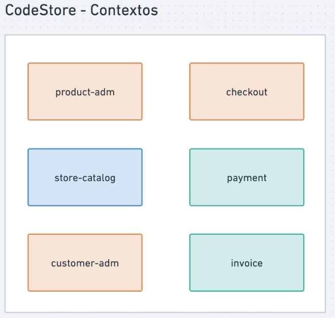
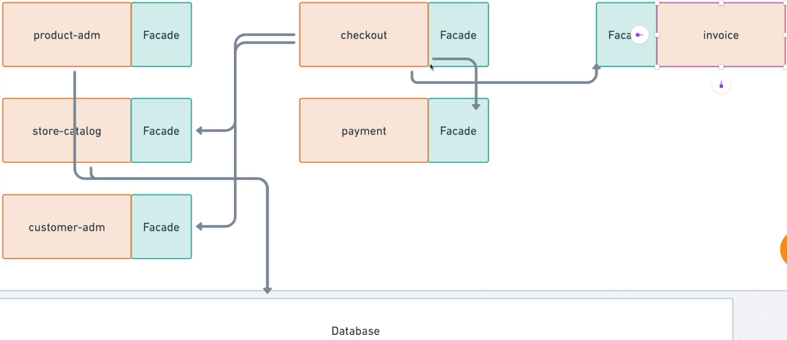

# Definição dos contextos do software

## Lista de subdomínios (bounded contexts)

- store-catalog (CORE)
- product-admin (SUPPORT)
- customer-admin (SUPPORT)
- checkout (SUPPORT)
- payment (GENERIC)
- invoice (GENERIC)

### Comunicação entre dos domínios

Será feita através de Facades.

Facade é um design pattern que tem como objetivo esconder dos clientes toda a complexidade interna de um módulo

Ele disponibiliza um serie de métodos para o cliente e por dentro ele realiza o repasse da requisição para os envolvidos

