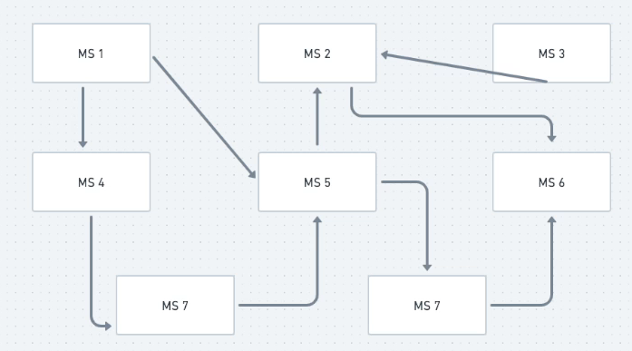
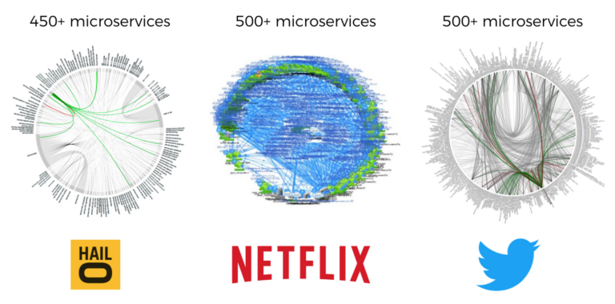

# Coreografia

Quando temos muitos microsserviços eles acabam dependendo de outro microsserviço para concluir seu processamento.
Isso ocorre pois cada microsserviço tem uma função e as coisas acontecem de forma descentralizada
Por exemplo, o MS1 depende do MS5 que depende do MS8 e por ai vai. Assim as chamadas surgem de forma orgânica, sem ninguém definir

A comunicação acaba se tornando uma loucura porque não temos um maestro que deve mostrar como a comunicação deve acontecer

E se tivermos mais microsserviços com mais comunicação orgânica? Vai ficar quase impossível de mapear todo fluxo

Tem um termo chamado Death Star (Estrela da morte) que é uma espécie de diagrama que mostra todos os microsserviços e as chamadas entre si. A maioria das big tech possuem sua Death Star

Quando trabalhamos com muitos microsserviços é quase inevitável que isso ocorra.
Mas o importante é: isso ocorre porque está tendo um COREOGRAFIA, uma sequência de passos definidos e pensados, entre os microsserviços
