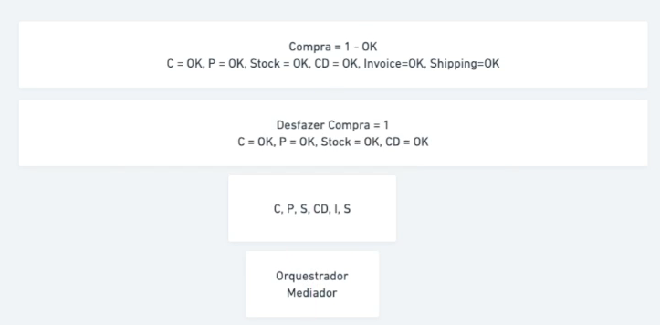
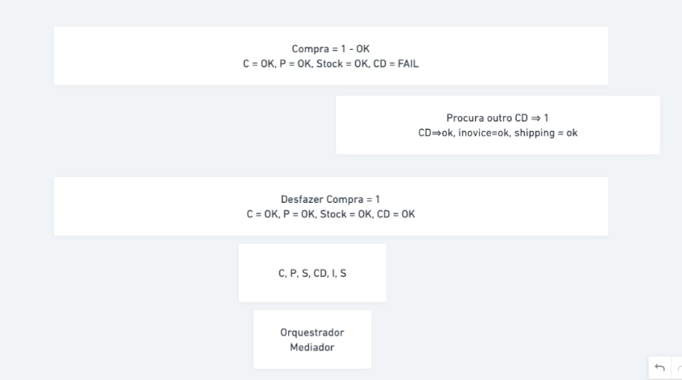

# Dinâmica de Orquestração

Quando falamos de orquestração estamos falando de ter um coordenação no processo de chamadas dos nossos microsserviços

Vamos tomar como exemplo o caso abaixo

Supondo de o MS CD (centro de distribuição) falhou alguma ações terão que ser canceladas, como:

- Invoice, cancelar a nota fiscal caso tenha sido emitida
- Stock, restaurar a quantidade do produto
- Payment, realizar o reembolso

E dentro dessas ações também temos uma ordem, o reembolso só pode ocorrer após o cancelamento da nota fiscal.
Isso nos leva pensar: qual serviço vai chamar o outro e quando?
E é nesse ponto que entram os Maestros/Mediators

## Maestros/Mediators

Maestros/Mediators são os responsáveis por receber a solicitação e orquestrar todas as chamadas.
Neles temos um fluxo definido para cada chamada e também fluxos, podendo ter sub-fluxos, de fallback caso ocorra uma falha.

Cada etapa pode ter, ou não, um fluxo de fallback que irá tentar resolver o problema ou apenas desfazer o que deve ser desfeito

Mediator é um [Design Pattern](https://refactoring.guru/design-patterns/mediator)

## Conclusão

Utilizando a orquestração tudo fica mais organizado e no fim fica mais simples de entender, mas isso não diminui toda a complexidade inicial em definir o funcionamento do mediator, fluxo, sub-fluxos, fallbacks e estratégias de controle.
