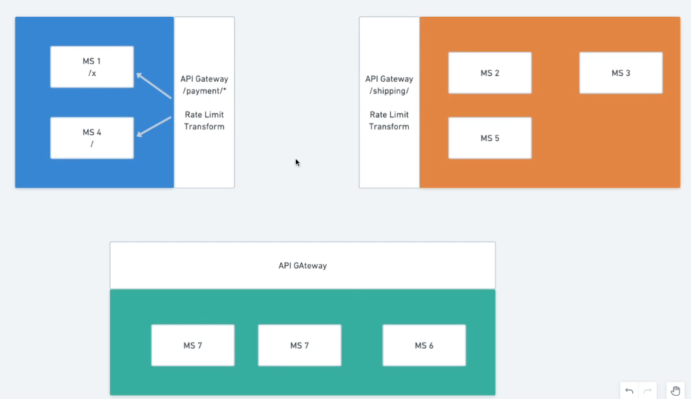
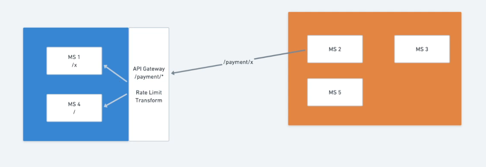

# Estratégias de APIs

## Coreografia - Mitigação da estrela da morte

Sempre quando temos muitos microsserviços podemos separá-las por contexto.
Fazendo essa divisão, em vez de serviços de outros contextos se comunicarem diretamente, podemos adicionar uma API Gateway na frente de cada grupo de MSs

Logo, em vez de microsserviços de contextos diferentes realizarem chamadas diretas, eles vão requisitar a API Gateway do contexto que o MS desejado se encontra.

Também conseguimos aplicar regras como rate limit, transforms, etc nessas API Gateways

## Conclusão

Aplicando os contextos e API Gateways deixamos nossa rede bem mais organizada
Antes de ver a comunicação direta entre serviços podemos ver a comunicação entre contextos
