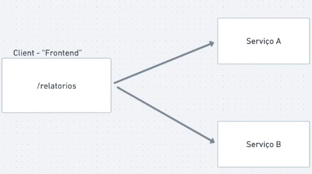
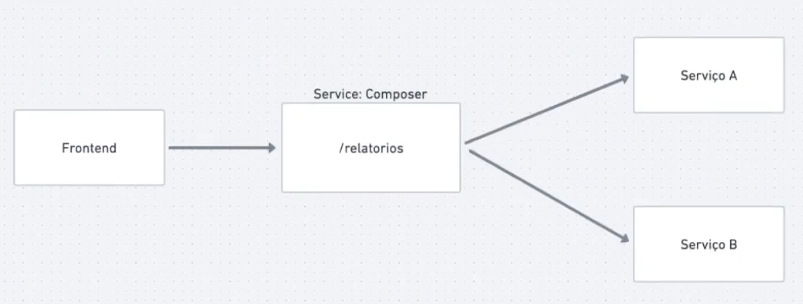
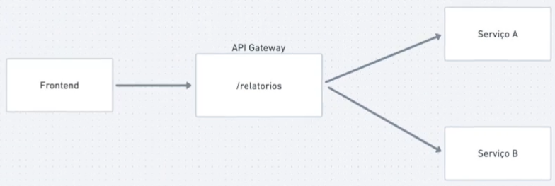

# API Composition

## Problemática

Vamos imagina que temos 2 serviços que nos fornece dados distintos mas com uma campo comum entre eles
E que também precisamos montar um relatório com as informações desses dois serviços.
Podemos criar um novo serviço independente que gere esse relatório ou reaproveitar esses 2 serviços

## Maneiras de lidar

- Criar um client que chame esses serviços e organize as informações

- Criar um novo serviço que organize esses dados e tenha uma forma de outros poderem acessar

- Utilizar um API gateway para disponibilizar um entrada e ele mesmo realizar as chamada

## Vantagens

Utilizando esse pattern podemos compor informações de diversas fontes e disponibilizar a informação já tratada

## Desvantagens

### Disponibilidade

Esse centralizador depende de que todos os serviços estejam ok para funcionar

### Consistência

Lembre-se: No mundo distribuído muitas vezes temos a consistência eventual. Então as informações disponibilizadas podem não ser 100% verídica

### Aumento da complexidade

Ter que chamar muitos serviços para depois tratar, organizar e formatar os dados vai ser complexo

### Serviço pra ler serviços

Ter que criar um novo serviço apenas para consultar outros serviços

### Alta latência

Realizar a várias chamadas fará o serviço esperar a resposta e assim a latência vai aumentando de acordo com a quantidade de requisições

### Comunicação síncrona

Um API Composition geralmente será síncrono, pois ele irá consultas vários serviços e precisa do retorno na hora.

## Resiliência

Nesses casos, quando um ou vários serviços estão indisponíveis ou tendo um comportamento inesperado temos que ter um plano B

- O que fazer com os dados que consegui?
- Posso enviar uma informação reduzida utilizando o que tenho?
