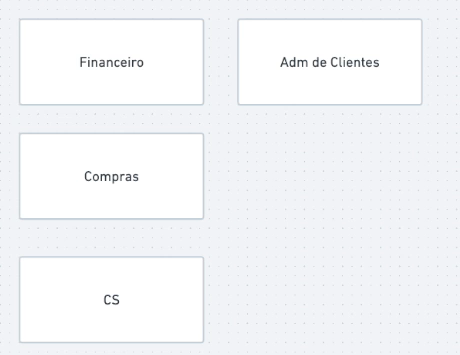
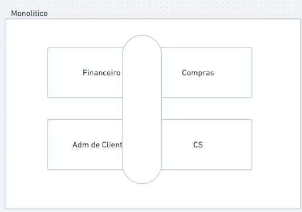

# Decompose by business capability

Toda empresa começa tendo um monolítico que acaba crescendo mais do que devia e torne necessário quebrar esse cara, descompô-lo

Esse monolítico acaba abrangendo várias, se não todas, áreas do negócio. Vamos ter a imagem a abaixo como exemplo

Esse Pattern sugere que façamos a separação do monolítico pelas áreas do negócio
Então podemos pegar nosso exemplo e decompor assim

A ideia desse partner é bem simples. O problema vem na hora de definir o que cada microsserviço faz. As áreas de negócio podem estar interligadas entre si

Para definir melhor o que cada microsserviço fará, temos que lembrar dos Bounded Contexts do DDD. Que são os contextos delimitados do meu negócio. Muitas vezes esses contextos são as próprias áreas do negócio

O DDD vai auxiliar muito nesse processo mas ainda sim será muito custoso e trabalho decompor o monolítico por completo
