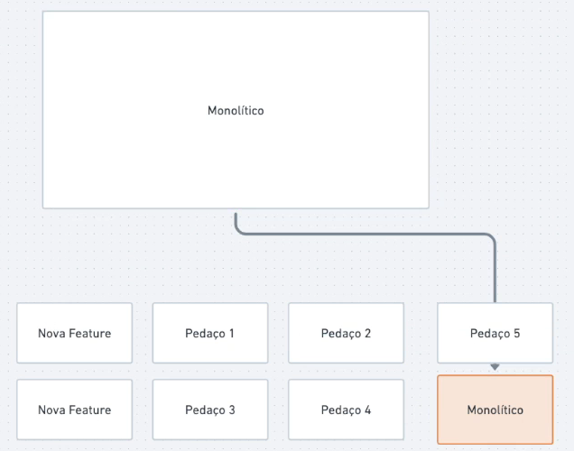

# Strangler application Pattern

## Apresentação

Esse padrão possui duas ideias para ir segregando nosso monolítico aos poucos

1. Toda nova feature será transformada em microsserviço
2. Pegar pequenos pedaços do sistema monolítico e transformar em microsserviços

Seguindo esses 2 passos a relevância do monolítico vai diminuindo e diminuindo até que possamos considerá-lo mais um microsserviço

## Mundo Real

A ideia parece tão simples, mas na hora de por em prática no deparamos com vários pontos de atenção, sendo alguns deles:

- Comunicação com o monolítico
  - Um microsserviço novo e sozinho não vai conseguir fazer nada se não houver alguma comunicação com o monolítico

- Maturidade da equipe:
  - Ter um processo de CI/CD bem estruturado
  - Os membros devem está familiarizados com os tipos de comunicação entre serviços

- Banco de dados:
  - Possuir um banco compartilhado apenas no inicio da segregação
  - Microsserviços (MS) DEVEM ser independentes e ter seus banco de dados isolados
  - Migrar os dados relevantes para o BD de cada MS
  - Consistência eventual

- Observabilidade
  - Cada MS deve ter um APM desde o dia 1
  - Ser capaz de obter as métricas independente do período de tempo
  - Alarmes e monitoramento
