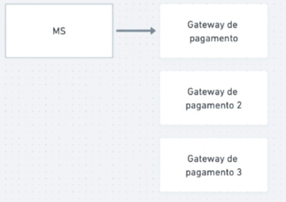
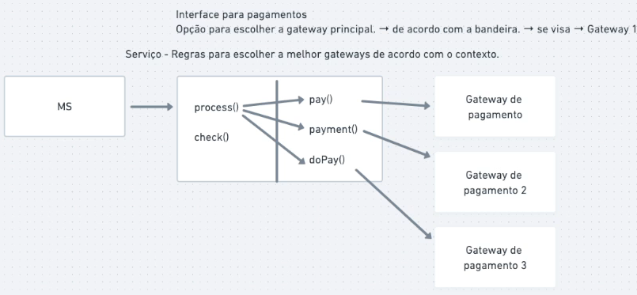

# Anti-Corruption Layer (ACL)

## Problemática

Temos vários serviço e alguns deles utilizam gateways de pagamento para realizar algumas transações.
Atualmente utilizamos apenas o gateway 1 mas queremos adicionar o gateway 2 devido a bandeira Y cobrar menos taxa e também queremos adicionar a gateway 3 segurança

Dessa maneira, sempre que for alterado algo relacionado a pagamento terei que alterar todos os serviços que utilizam isso, já que foi implementado dentro de cada um

## O que é ACL

Para evitar esse tipo de problema utilizamos ACL, que é uma camada (serviço) entre os MS e as funcionalidade de pagamento

Nele teremos uma abstração, uma porta de entrada para todos que precisarem poderem ter acesso aos meios de pagamento
E também temos a implementação, que a utilização gateways de pagamento de acordo com as regras definidas

Assim, centralizamos em um único ponto o problema das gateways de pagamento e as regras de quando utiliza qual

## Considerações finais

Este é um padrão fundamental para tornar seus serviços mais independentes e para centralizar possível problemas co-relacionados em um único ponto

Podemos criar um serviço como ACL sempre que tivemos domínios de suporte

- Gateways de pagamento
- API's de consulta (CEP, CNPJ, localização)
