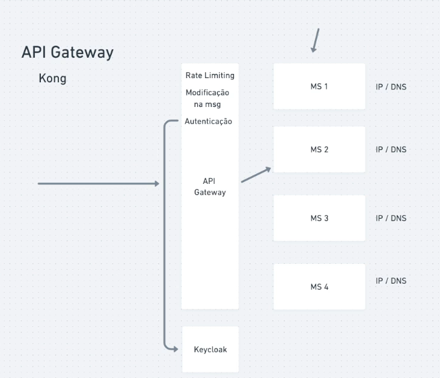

# API Gateway

Nos mundo dos MS muitos deles são acessados via web.
Imagina ter q disponibilizar os ips/dns por serviço, sendo q eles podem ser escaláveis tendo vários containers/pods?

Com uma API Gateway temos um ponto de entrada pra nossa malha de MS

A API Gateway é a responsável por receber as solicitações e redirecionar para o serviço requisitado, não precisando disponibilizar os serviços diretamente para a web

Conseguimos nela configurar algumas coisas como rate limit, transforms, autenticação e muito mais. Poupando o trabalho de fazer tudo isso em cada serviço

