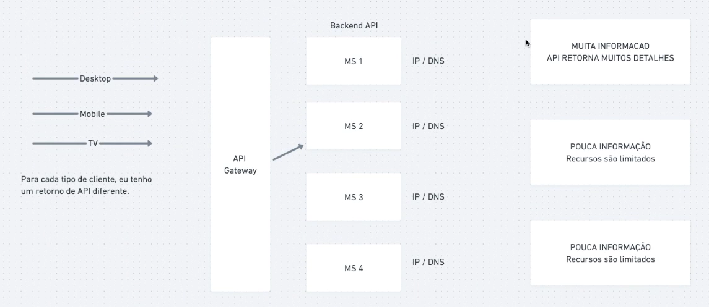
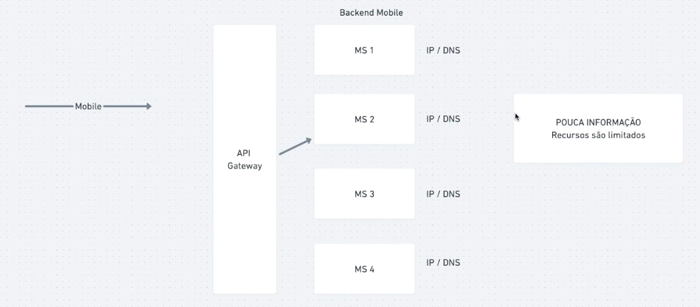
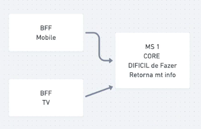

# Backend For Frontend (BFF)

## Introdução

No mundo moderno temos uma gama enorme de dispositivos que podem acessar a web
Computador, celular, TV, tablet, relógios...
E o mesmo site é diferente em cada um desses dispositivos, devido aos recurso que o tamanho da tela de cada um

Um site acessado do computador geralmente utiliza mais informações que acessado do celular. Tráfego de dados é algo caro, concordamos que enviar mais dados do que utilizado é dinheiro jogado fora

## BFF, o que é?

E é ai que entre o BFF. BFF é ter backends diferentes para cada tipo de frontend.

Mas ai você pensa: Recriar serviços é algo trabalhoso e custoso, principais serviços CORE.

Uma solução é criar um BFF que chama esse serviço, filtra os dados e retorna somente o necessário

Não precisamos recriar todo o back end, precisamos apenas de uma camada que realize essa filtragem, mas nada impede de recriar o serviço

## GraphQL pode substitui BFF?

GraphQL é uma linguagem para API, onde temos uma interface para receber solicitações e retornar o resultado.

A grande vantagem dele é que o client informa quais informações ele deseja receber no retorno. Então o GraphQL pode sim substitui o BFF

Mas lembre-se que nem tudo são flores... Trabalhar com GraphQL não é tão simples, tudo tem suas vantagens, desvantagens e peculiaridades
