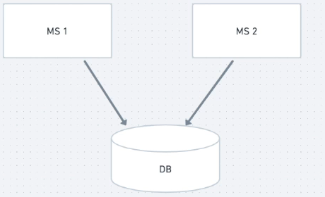

# Banco de Dados

## Microsserviços compartilhando o mesmo banco

### Vantagens mesmo banco

- Não precisa se preocupar com inconsistência
- Todos os serviços possuem acesso a todos os dados, evitando voltas para pegar informações que poderiam estar em apenas um serviço
- Facilita na hora de separar o monolítico em MS pois não precisar pensar na comunicação e divisão de BDs

### Desvantagens mesmo banco

- Se o MS-1 alterar o modelo do banco, o MS-2 pode quebrar
- Se o MS-2 começar a ter muitos acesso e utiliza muito o BD, o MS-1 terá um queda de performance por conta disso

## Microsserviços com bancos segregados

### Vantagens bancos segregados

- Ajuda na independência dos microsserviços
- Liberdade para modificar o banco quando necessário

### Desvantagens bancos segregados

- Ter que dar manutenção a vários DBs
- Saber como dividir os dados e em quais bancos ficarão
- Consistência eventual

## Conclusão

Não existe certo ou errado, tudo depende. Quando ainda estamos no inicio da jornada de dividir o nosso monolítico é melhor manter um banco só. Mas quando os microsserviços já estão consolidados o melhor seria ter um banco para cada serviço
