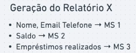

# Relatórios e consolidação de informações

Relatórios são feitos utilizando vários dados de muitas tabelas/collections.
Mas quando temos vários Banco de Dados separados, um por microsserviços.

Para gerar o relatório o serviço chamado deve consultar outros outro pra pegar os dados e isso é complexo e custoso

Temos algumas medidas que podemos tomar para não deixar menos complexo.

- Gerar relatório em background e disponibilizar o resultado depois
- Criar um serviço de relatório que se comunica com os outros serviços para consolidar as informações
- Tabela de projeção (Tabelas projetadas) com os dados já estruturados na maneira que desejar

Essa tabela projetada é muito utilizada. Existem algumas formas de manter essa tabela atualizada:

- Cada vez que o MS-I mudar o nome, ele muda nos dois bancos de dados
- MS 4 escuta os eventos de alteração e faz a atualização da tabela.
- Consistência eventual

Tendo essa tabela sempre atualizada não precisamos acessar vários bancos de dados ou microsserviços atrás de informações para montar os relatórios
