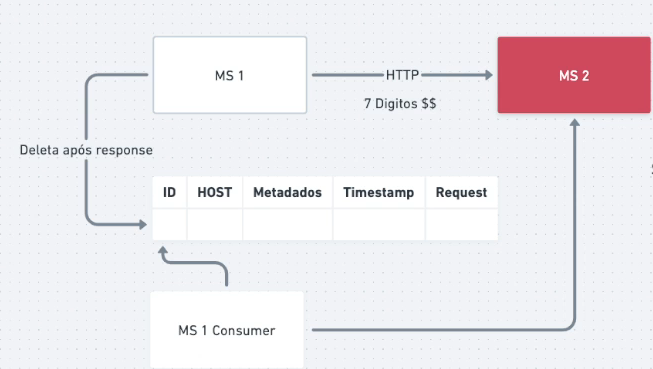

# Transactional Outbox

## Problemática

Temos um MS que realiza um transação muito importante, mas para concluir ele depende de outro MS.
Mas esse outro serviço estava fora do ar e mesmo com os retry ele não tinha voltado. Você vai perder essa transação?

## O que é esse partner?

Transactional Outbox é nada mais que salvar as transações que você julgar importante em algum outro banco de dados.
A persistência deve ser a primeira coisa ser feita e somente quando o processamento for terminado com sucesso que essa transação será apagada

Quando o processamento falha temos as transações salvas no nosso banco. Então o MS que as registrou também deve consultar esses registros de tempos em tempos para reprocessar essas solicitações

Esse banco de dados deve ser algo a parte dos nossos DBs utilizados no dia dia

Esse pattern também pode ser utilizado quando seu message broker estiver fora do ar. É uma camada extra de resiliência. E quando o message broker voltar podemos reenviar para eles
