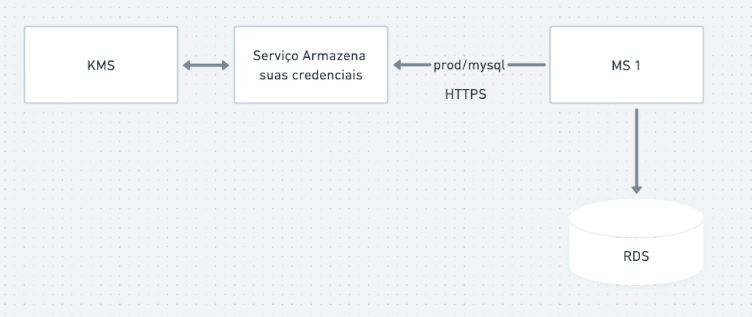
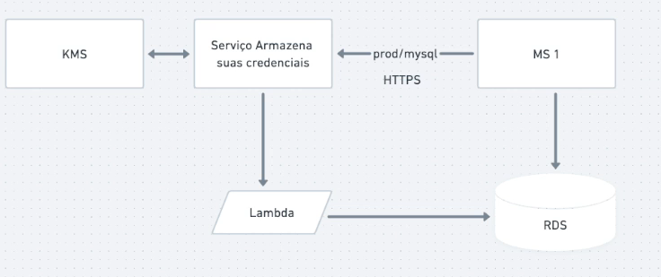

# Secret Manager

## Problemática

Todo sistema possui string de conexão, senhas, tokens que utilizam para acessar e validar informações

Esse dados ficam salvo em algum local, seja no próprio código (totalmente errado), nos .env ou nas variáveis de ambiente

Mas imagina gerenciar esse dados para 10, 100, 500 serviços? Sendo que muitos deles podem ser as mesma variáveis e temos que manter seus valores iguais

Tudo começa ficar mais complexo, principalmente quando temos que alterar alguma ENV que está em vários serviços, e a segurança dessas informações é extremamente importante

## O que é Secret Manager

Secret Manager é um serviço de armazenamento de credenciais da AWS.
Cada cloud provider possui o seu

- Secret Manager - AWS
- Vault - hashicorp

Suas credenciais ficam salvas nesse serviço e os MS fazem chamadas para obter o valor da chave solicitada

## Rotacionando credenciais

Podemos pedir para o Secret Manager rotacionar/trocar alguma variável ou configurar pra isso ocorrer de tempos em tempos

E o melhor é que podemos organizar de um forma que quando ele altere o valor, ele vá no banco de dados (exemplo) e atualize o valor da credencial lá também

Quanto mais minhas senhas forem alteradas menor são os riscos. Esse recurso nos promove maior segurança e organização/gerenciamento dos nossos dados importantes
