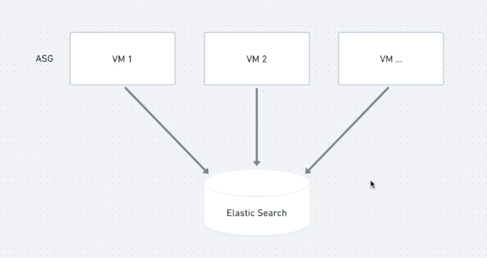

# Padronização de Logs

## Como funcionam os logs

Log é o resultado de um evento. Um informação importante para verificar o que está acontecendo dentro do meu software

Vamos imaginar que temos um MS que é escalável horizontalmente.
Ou seja, tenho 1, 2, 5, 10... cópias desse cara

Quando o cliente está utilizando e ocorre algum erro, o log é exibido no container/vm desse MS. E isso é um problema pois:

- É necessário acessar N réplicas para encontrar o log
- As vezes você não vai nem conseguir encontrar pois a réplica com essa informação já foi destruída

Então, para evitar a perca desses logs centralizamos em um único local, como o graylog ou elastic search

## Problemática

O nosso repositório de logs recebe os logs de vários serviços. Porém, não foi definido nenhum padrão para esses logs

- MS-1: [Timestamp, Nome do sistema, IP. Stack trace]
- MS-2: [Timestamp, IP. Nome do sistema, Stack trace]

Isso é um problema, pois na hora de realizar as buscas e filtros os dados podem ficam bagunçados. Com os logs fora de padrão ficamos perdido na hora de tentar encontrar o problema

## Solução

Temos que definir um padrão para nosso logs, com as informações que achamos relevantes.

Mas mesmo com um padrão definido, ter que seguir ele de forma manual em cada serviço nos deixa a mercer do erro humano

O ideal seria criar um SDK somente para logs e utilizá-lo em cada MS.
