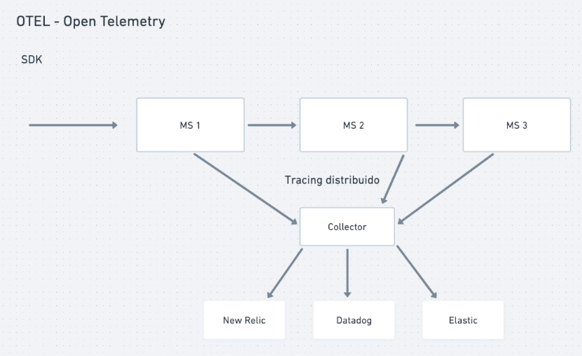

# Open Telemetry

É um SDK criado para padronizar dados de observabilidade e evitar que fiquemos preso no vendor a alguma vendor

Ele possui uma abstração que coleta os dados e conseguimos configurar para enviar pras quais vendors queremos, seja Datadog, new relic, elastic...

