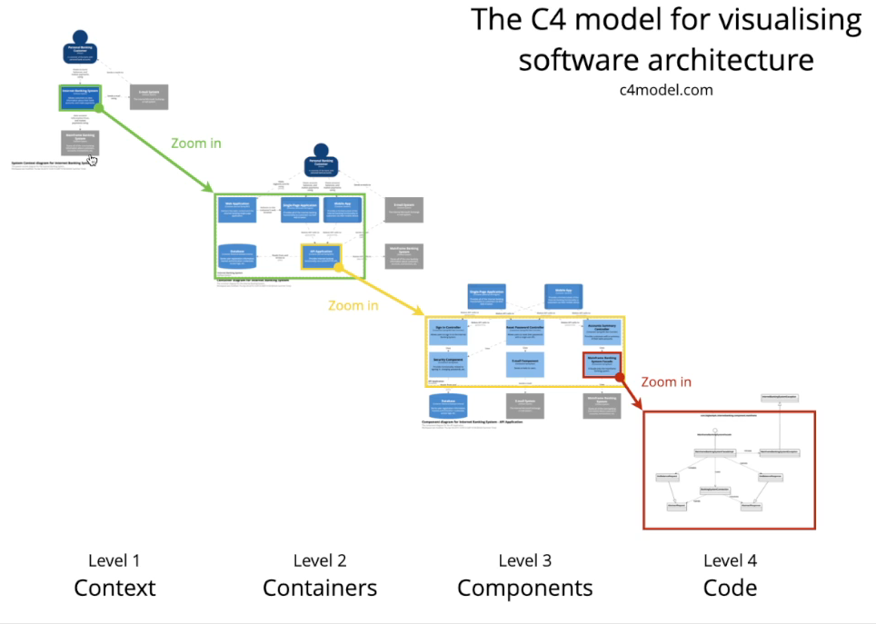

# C4 Model

## Introdução

[C4 Model](https://c4model.com/) serve para documentar a arquitetura de software de um forma simples, clara e objetiva

C4 - Context, Containers, Components, and Code

## Níveis

O C4 model possui 4 níveis:

- Level 1: Context
  - Visão geral do contexto onde o software está inserido e com quem ele se comunica
- Level 2: Containers
  - Visão dos sistemas que seu software possui e a interação entre eles
- Level 3: Components
  - Visão do funcionamento do container(sistema), suas nuances
- Level 4: Code
  - Visão interna e mais baixo nível: Diagrama de classes, UML...

Normalmente apenas o nível 1 e 2 são feitos, pois antes de fazer a documentação você deve também conseguir mantê-la. Os 3 e 4 geralmente possuem bem mais mudanças e com mais frequência, então manter esses níveis sempre atualizados pode dar trabalho
