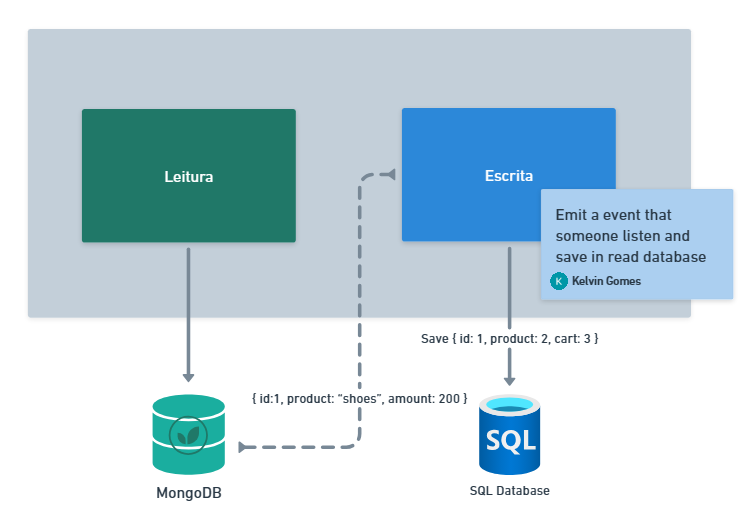

# EDA - Event Driven Architecture

## Eventos

### O que são eventos?

Eventos são efeitos colaterais de um sistema. Um evento é algo que aconteceu no passado.

### Pontos importantes

- Podemos trabalhar com eventos de forma internalizada no software ou externalizada
- Domain Events (Eventos de domínio): Mudança no estado interno da aplicação / regra de negócio

### 3 tipos/formas de eventos

#### 1. Event Notification

- Evento utilizado quando um sistema quer notificar outros pontos que algo mudou
- Forma curta de comunicação { "pedido": 1, "status": "aprovado" }
- Informa apenas o que mudou + alguma possível informação relevante

#### 2. Event Carried State Transfer

- Formato completo para trafegar dados, "Stream de Dados"
- { "pedido": 1, "status": "aprovado", "produtos": [...], "valor": 10 ... }
- Devido o envio de mais dados, fica mais fácil para outros sistemas trabalharem sem necessitar realizar outra busca. Mas aumenta o custo de CPU pra processar mais dados e o tráfego de rede

#### 3. Event sourcing

- É a forma de captar os eventos que ocorrem no sistema e armazená-los, geralmente em um time series database
- Temos assim tudo que ocorreu dentro do sistema e quando ocorreu
- Utilizar isso é extremante vantajoso porque temos todo o histórico de tudo que aconteceu no sistema e eventualmente podemos fazer um replay e reprocessar algum desses eventos
- Muito útil também para processos de auditória
- Podemos fazer event sourcing com
  - Apache Kafka
  - Datomic Database
- É comum utilizar vários tipos de armazenamentos para guardar esses dados
  - Dados quentes (novos, muito utilizados): manter em storages mais ágeis
  - Dados frios (antigos, pouco utilizados): storages mais lentos
  - Lembrando que quem define o que é um dado quente/frio é a equipe
- Uma alternativa também é o Apache Pulsar Bookkeeper

### Event sourcing vs Command sourcing

Entendemos que o comando é a ação e o evento é a consequência/resultado.

Seguindo essa linha de raciocínio, Command sourcing seria você registrar todos os comandos (requests) que ocorre em seu software.

É muito interessante a ideia de poder refazer tudo que já aconteceu mas utilizando as circunstancias atuais.

Mas isso requer grande armazenamento e deve ser utilizado em situações realmente necessárias

### Event Collaboration

QUALQUER mudança em QUALQUER software gera um evento.

Dessa forma, em vez de um sistema ir buscar algo em outro. Ele pode ficar ouvindo os eventos desse outro sistema e guardar essa informação com ele. Assim não é necessário fazer a busca pois o sistema já tem o que precisa e deve partir do princípio que está com a informação atualizada

(Tópico complexo, assistir a aula e ler o [artigo](https://martinfowler.com/eaaDev/EventCollaboration.html) para melhor compreensão)

### CQRS (Command Query Responsibility Segregation) + Event Sourcing

#### CQS vs CQRS

- Maior diferença seria o nível de granularidade
- CQS: Nível de componente/classes (micro)
- CQRS: Nível de contexto/software (macro)

#### Entendendo CQRS

Nosso software pode ser divido em Comandos e Consultas

O comando é uma ação que realiza mudanças no meus objetos de domínio. Por isso que os comandos devem ser codificados seguindo as regras impostas pelo domínio da aplicação (DDD)

Já as consultas é a recuperação de dados. Vamos imaginar uma consulta que deve retornar um pedido. Mas dentro do pedido tem os itens, e dentro de cada item tem uma nota fiscal, e dentro de cada nota fiscal tem o emissor... O que quero dizer é: Um agregado pode ser muito complexo e montá-lo por completo vai custar muitas buscar e relacionamentos no banco de dados.

E se as consultas não seguissem toda essa burocracia? Em vez perder tempo hidratando/montando esse agregado ou então pensando em uma outra modelagem pro domínio que favoreça tanto a escrita quanto a leitura porque não seguir o seguinte caminho: "Consultas não obedecerem os modelos de domínio"?

A ideia é justamente essa. Deixar a maior complexidade e regras para quem altera os dados. As consultas podem ser mais simples e diretas, até porque, por exemplo, nem sempre que consultarmos o pedido vamos querer os seus itens, não é?

Trabalhar com consultas específicas retornando somente o que foi pedido é muito mais simples. Esquecemos os domínio e focamos no DADO em si (data centric)

#### CQRS e separação física de dados

Separando a leitura e a escrita podemos (não obrigatório) utilizar bancos diferente para leitura e escrita

Esse banco de somente leitura teria os dados de uma maneira mais simples para consulta, para não precisar de relacionamento ou consultas complexas.

Note que esse banco de leitura é como se fosse uma VIEW do banco principal

Essa banco de leitura pode ser atualizando por meio do Event Sourcing. Podemos dizer que eles andam lado a lado, já que normalmente temos alguém responsável por receber todos os eventos e ele poderia também manter meu banco de leitura atualizado utilizando esses eventos

#### Como implementar CQRS

Como sempre, não temos um regra universal que irá servir para todos os casos, mas tem alguns pontos que podemos refletir quando quisermos utilizar CQRS:

- As consultas precisam seguir o meu domínio?
- É realmente necessário uma camada de caso de uso/serviços entre a controller e os DAO's?
- Organização X Complexidade
  - Seguir um padrão pode tornar nosso software mais organizado. Mas tudo realmente seguir isso?
  - Um software que utiliza a Clean Architecture e DDD na veia, mas a maioria dos comandos são relacionados a leitura... Não seria menos complexo/custoso dizer "não" para as duas perguntas acima?
