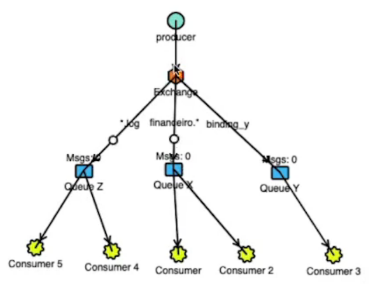

# RabbitMQ

## Introdução

RabbitMQ é um dos message broker mais conhecidos e confiáveis no mercado.
Ele implementa os protocolos AMQP, MQTT (mais utilizado e muito rápido), STOMP e HTTP

Algumas características:

- Desenvolvido em Erlang
- Desacoplamento entre serviços
- Rápido e poderoso por utiliza diretamente a memória da máquina
- Padrão de mercado

## Funcionamento

- Publisher: Quem envia/publica as mensagens
- Consumer: Quem fica ouvindo/esperando novas mensagens na fila
- Queue: Fila que armazena as mensagens
- Exchange: Quem recebe as mensagens enviadas pelo Publisher, realizar o processamento e públicas na(s) fila(s) (Queue) desejada(s)

Regra geral: Nunca publicar diretamente no tópico, enviar sempre para a Exchange

### Tipos de Exchange

- Direct: Mando uma mensagem para a exchange e ela envia diretamente para uma fila (utilizando a routing key)

- Fanout: Mando uma mensagem para a exchange e ela envia para todas as filas relacionadas com essa exchange (não utilizar a routing key)

- Topic: Mando uma mensagem para a exchange e ela envia para uma fila de acordo com a regra do tipo da mensagem

- Header: Mando uma mensagem para a exchange e ela envia para uma fila de acordo com o cabeçalho (formato menos utilizado)

Conceitos:

- Bind: Relacionar uma Queue com uma Exchange
- Routing key: é o identificador de um caminho que a exchange pode enviar as mensagens

### Entendendo Filas

As filas são estruturas do tipo FIFO (First In, First Out). Podemos trabalhar com prioridades mas isso quebraria o FIFO e pode ocasionar numa bagunça

Algumas propriedades que você pode utilizar ao declarar (criar) uma fila:

- Durable: Se ela deve ser salva mesmo depois do restart do broker
- Auto-delete: Removida automaticamente quando o consumer se desconecta
- Expiry: Define o tempo que não há mensagens ou clientes consumindo
- Message TTL: Tempo de vida da mensagem
- Overflow
  - Drop head (remove a última)
  - Reject publish
- Exclusive: Somente channel que criou pode acessar
- Max length ou bytes: Quantidade de mensagens o tamanho em bytes máximo permitido
  - Caso aconteça, teremos um overflow e podemos escolher em remover as mensagens mais antigas ou rejeitar a nova

### Dead Letter Queues

Algumas mensagens não conseguem ser entregues por qualquer motivo:

- Falha no processamento
- Excedeu o tempo na fila
- Dentre outros

Essa mensagens podem ser encaminhadas para uma Exchange específica que roteia as mensagens para uma dead letter queue e tais mensagens podem ser consumidas e averiguadas posteriormente.

### Lazy Queues

As vezes nosso fluxo de mensagem é tão grande que os consumidores não conseguem processar tudo rapidamente e isso pode acabar sobrecarregando a memória.

Quando há milhões de mensagem em uma fila, por qualquer motivo, há a possibilidade de liberar a memória, jogando especificamente as mensagens da fila em questão em disco.

Para isso foram criadas as Lazy Queues. Com elas as mensagens são armazenadas em disco e elas não são perdidas quando a máquina é desligada, mas isso exige alto I/O

## Anotações dos testes

### Múltiplos Consumers de uma mesma Queue

Quando temos 2 consumidores a mensagens são distribuídas intercaladamente entre eles, ou seja, é feito um balanceamento automático das mensagens entres os consumidores

Dessa forma, é impossível que todos os consumidores de uma mesma fila recebam todas as mensagens dessa fila

### Múltiplos Consumers de uma mesma mensagem

Para ser possível vários consumidores receberem todas as mensagens precisamos que a Exchange seja Fanout e que cada um esteja em uma fila diferente (por conta do tópico acima) e as fila obviamente devem ter feito o bind com a Exchance

### Exchange Topic: Enviando para várias filas

Quando enviamos uma mensagem e sua binding key da match com mais de uma binding key, essa mensagem é enviadas para todas as filas

