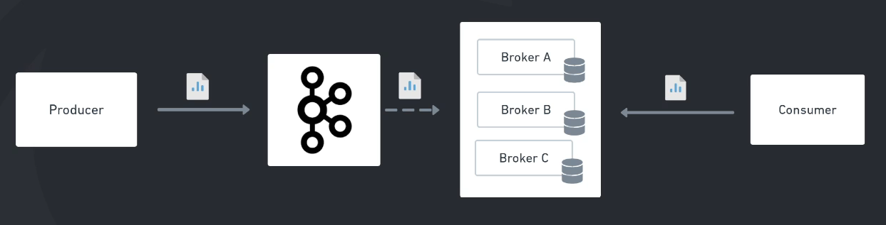
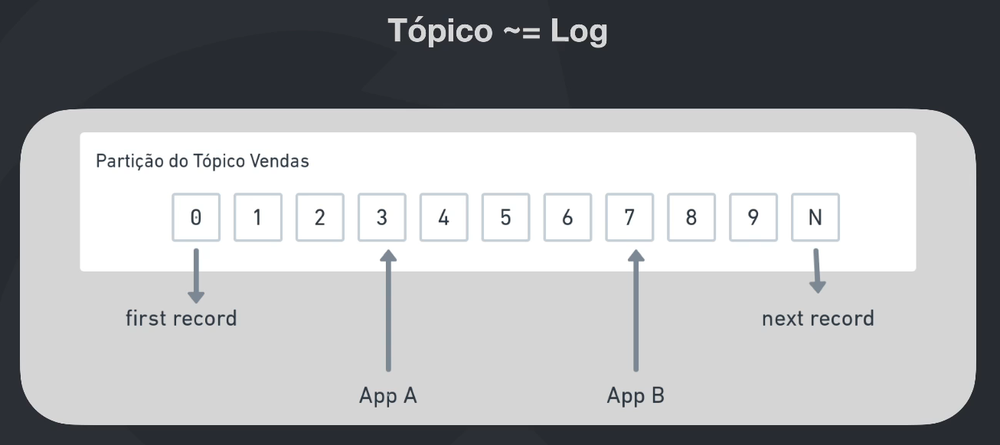

# Apache Kafka

"O Apache Kafka é uma plataforma distribuída de streaming de eventos open-source que é utilizada por milhares de empresas para uma alta performance em pipeline de dados, stream de analytics, integração de dados e aplicações de missão crítica".
[Site Oficial](https://kafka.apache.org)

## O mundo dos eventos

A cada dia, lidamos com o desafio de processar um número crescente de eventos em diferentes plataformas. Isso inclui a comunicação entre sistemas, dispositivos para a Internet das Coisas (IoT), monitoramento de aplicações, sistemas de alarme, entre outros.

Basicamente tudo emite eventos e precisamos ser capazes de processar essa quantidade massiva de eventos

Perguntas

- Onde salvar os eventos? Existem situações que queremos salvar os eventos, como o event sourcing, ou questões compliance
- Como recuperar de forma rápida e simples de forma que o feedback entre um processo e outro ou mesmo entre um sistema e outro possa acontecer de forma fluida e em tempo real?
- Como escalar? Realizar a distribuição desses eventos de uma maneira correta entre vários serviços e várias réplicas de um mesmo serviço
- Como ter resiliência de alta disponibilidade? Não podemos perder mensagens e algo que seja "impossível" de ficar fora do ar

## Os super poderes do Kafka

- Altíssimo throughput
- Latência extremamente baixa (2ms)
- Escalável
- Armazenamento
- Alta disponibilidade
- Se conecta com quase tudo
- Bibliotecas prontas para as mais diversas tecnologias
- Ferramentas open-source

O Kafka é bem robusto e completo, trazendo junto uma certa complexidade. Antes de utilizar devemos pensar se estamos em umas das duas seguintes situações:

- Geração e distribuição massiva de eventos
- Arquitetura complexa que vários serviços precisam comunicar-se entre si

## Dinâmica de funcionamento

### Funcionamento Geral

- Producer: Produtor, quem gera e envia as mensagens
- Consumer: Consumidor, quem acessa e trata as mensagens
- Kafka broker: O Kafka é um cluster, ou seja, um conjunto de máquinas que se coordenam e trabalham em conjunto. Um kafka broker é uma dessa máquina, cada um possui seu próprio banco de dados. É recomendado ao menos 3 brokers em caso de produção
- Zookeeper: Como o Kafka é um conjunto de máquinas precisamos de alguém para 'gerenciar', saber para onde enviar as mensagens e onde elas estarão. Esse cara é o zookeeper, normalmente temos ele para fazer esse gerenciamento, mas o Kafka está se tornando independente

O producer cria uma mensagem e envia para o Kafka broker que a salva em seu banco de dados. E o consumer se conecta ao broker e acessa essas mensagens. O Kafka NÃO envia mensagens, ele apenas guarda para os consumers lerem

### Tópicos

Tópico é o canal de comunicação responsável por receber e disponibilizar os dados enviados para o Kafka.

Os produtores enviam suas mensagens pra um tópico e os consumidores leem esses tópicos. O Kafka permite que VÁRIOS consumers se conectem a um topic e que todos recebam a mensagem

As mensagens são enfileiradas e possuem um "id" que chamamos de "offset", podemos dizer que é a posição da mensagem na fila do tópico

#### Anatomia de um registro

- Headers: metadados não obrigatórios que possam ser úteis.
- Key: Contexto da mensagem, agrupamento. Se eu enviar várias mensagens com a mesma key, essa mensagens serão lidas em ordem.
- Value: Conteúdo da mensagem
- Timestamp: momento da mensagem

### Partições

Podemos entender que a partição é um espaço reservado no armazenamento de uma das máquinas do kafka

Vamos ter um tópico que foi tem 3 partições, logo foram reservado 3 espaços em máquinas diferentes para salvar as mensagens enviadas para esse topic

E quais as vantagens?

- As mensagens estão distribuídas entre os brokers, então caso um fique fora o processamento não irá parar
- Tendo muitas partições distribuídas, podemos ter vários consumidores cada um lendo uma partição, acelerando o processamento das mensagens
