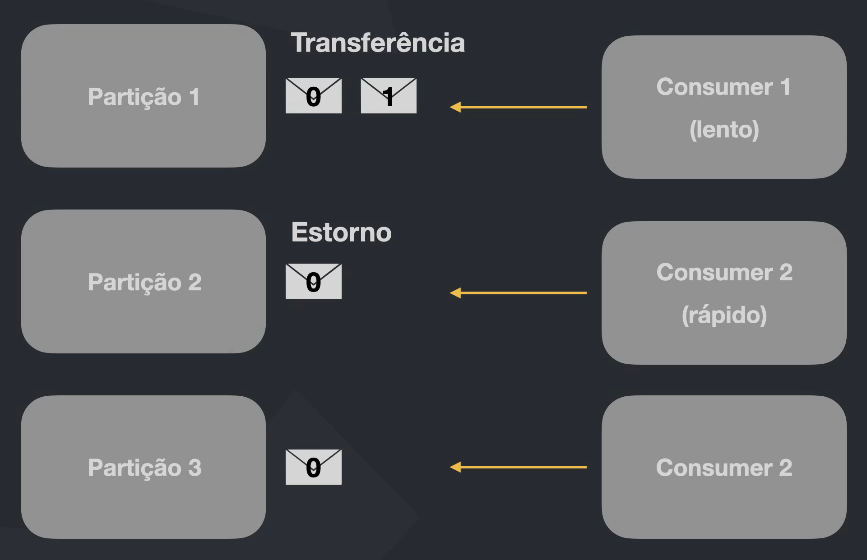
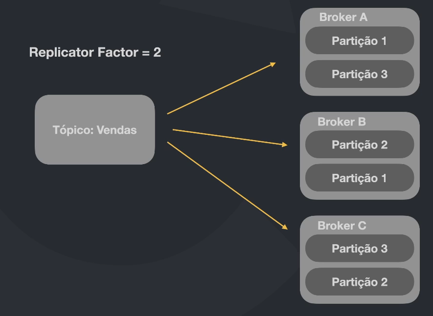
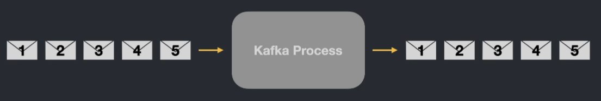
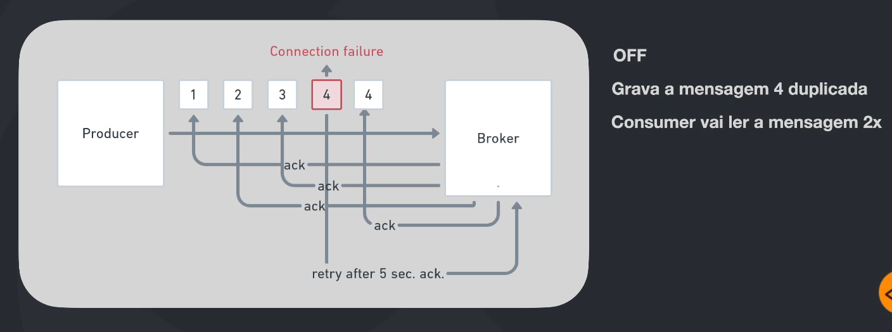
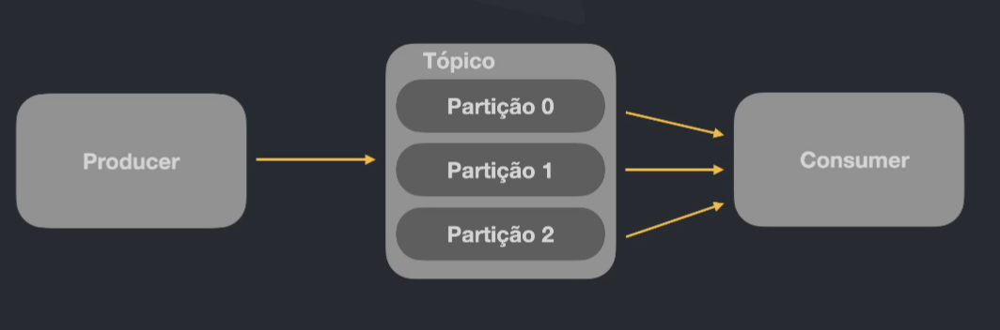
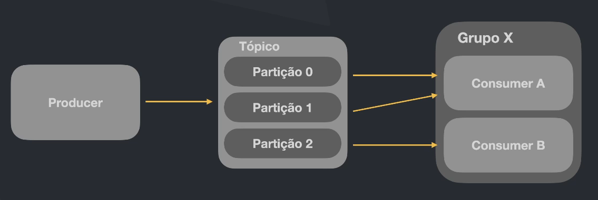

# Apache Kafka

"O Apache Kafka é uma plataforma distribuída de streaming de eventos open-source que é utilizada por milhares de empresas para uma alta performance em pipeline de dados, stream de analytics, integração de dados e aplicações de missão crítica".
[Site Oficial](https://kafka.apache.org)

## O mundo dos eventos

A cada dia, lidamos com o desafio de processar um número crescente de eventos em diferentes plataformas. Isso inclui a comunicação entre sistemas, dispositivos para a Internet das Coisas (IoT), monitoramento de aplicações, sistemas de alarme, entre outros.

Basicamente tudo emite eventos e precisamos ser capazes de processar essa quantidade massiva de eventos

Perguntas

- Onde salvar os eventos? Existem situações que queremos salvar os eventos, como o event sourcing, ou questões compliance
- Como recuperar de forma rápida e simples de forma que o feedback entre um processo e outro ou mesmo entre um sistema e outro possa acontecer de forma fluida e em tempo real?
- Como escalar? Realizar a distribuição desses eventos de uma maneira correta entre vários serviços e várias réplicas de um mesmo serviço
- Como ter resiliência de alta disponibilidade? Não podemos perder mensagens e algo que seja "impossível" de ficar fora do ar

## Os super poderes do Kafka

- Altíssimo throughput
- Latência extremamente baixa (2ms)
- Escalável
- Armazenamento
- Alta disponibilidade
- Se conecta com quase tudo
- Bibliotecas prontas para as mais diversas tecnologias
- Ferramentas open-source

O Kafka é bem robusto e completo, trazendo junto uma certa complexidade. Antes de utilizar devemos pensar se estamos em umas das duas seguintes situações:

- Geração e distribuição massiva de eventos
- Arquitetura complexa que vários serviços precisam comunicar-se entre si

## Dinâmica de funcionamento

### Funcionamento Geral

- Producer: Produtor, quem gera e envia as mensagens
- Consumer: Consumidor, quem acessa e trata as mensagens
- Kafka broker: O Kafka é um cluster, ou seja, um conjunto de máquinas que se coordenam e trabalham em conjunto. Um kafka broker é uma dessa máquina, cada um possui seu próprio banco de dados. É recomendado ao menos 3 brokers em caso de produção, sendo um deles o brokers leader que recebe e disponibiliza as mensagens
- Zookeeper: Como o Kafka é um conjunto de máquinas precisamos de alguém para 'gerenciar', saber para onde enviar as mensagens e onde elas estarão. Esse cara é o zookeeper, normalmente temos ele para fazer esse gerenciamento, mas o Kafka está se tornando independente

O producer cria uma mensagem e envia para o Kafka broker que a salva em seu banco de dados. E o consumer se conecta ao broker e acessa essas mensagens. O Kafka NÃO envia mensagens, ele apenas guarda para os consumers lerem

### Tópicos

Tópico é o canal de comunicação responsável por receber e disponibilizar os dados enviados para o Kafka.

Os produtores enviam suas mensagens pra um tópico e os consumidores leem esses tópicos. O Kafka permite que VÁRIOS consumers se conectem a um topic e que todos recebam a mensagem

As mensagens são enfileiradas e possuem um "id" que chamamos de "offset", podemos dizer que é a posição da mensagem na fila do tópico

#### Anatomia de um registro

- Headers: metadados não obrigatórios que possam ser úteis.
- Key: Contexto da mensagem, agrupamento. Se eu enviar várias mensagens com a mesma key, essa mensagens serão lidas em ordem.
- Value: Conteúdo da mensagem
- Timestamp: momento da mensagem

### Partições

Podemos entender que a partição é um espaço reservado no armazenamento de uma das máquinas do kafka

Vamos ter um tópico que foi tem 3 partições, logo foram reservado 3 espaços em máquinas diferentes para salvar as mensagens enviadas para esse topic

E quais as vantagens?

- As mensagens estão distribuídas entre os brokers, então caso um fique fora o processamento não irá parar
- Tendo muitas partições distribuídas, podemos ter vários consumidores cada um lendo uma partição, acelerando o processamento das mensagens

### Garantido ordem de entrega

#### Situação

Cada partição possui sua própria contagem de offset. Em casos que a ordem é importante, isso pode gerar uma confusão

No caso acima temos o problema de que o estorno seja processado antes da transferência, e isso não faz o menor sentido.

Para evitar isso precisamos que tanto as mensagens de transferência e de estorno vão para a mesma partição, assim não tem como alguém ler o estorno antes.

#### Keys para garantir ordem

E como fazemos as mensagens caírem na mesma partição? Utilizando as keys

Quando publicamos uma mensagem informado a key, todas as outras com a mesma key serão destinadas da mesma partição

### Partições distribuídas

#### O que são

Entendemos que as partições são espaços reservados no armazenamento do broker. Mas e se o broker cair? Nem sempre podemos ter o luxo de perder mensagens, e para isso o kafka possui o 'replicator factor'.

Traduzindo: fator de replicação. É a quantidade de cópias que nossas partições devem ter em outros brokers

No caso acima, temos um tópico de vendas que possui 3 partições e também com o replication factor 2. Então todas partição tem uma cópia em outro broker.

Assim temos uma maior resiliência e garantia de que não vamos perder os dados caso um broker fique fora do ar.

Ter 2 réplicas é o mínimo aceitável para garantir a persistências das mensagens.

#### Partition leadership

Quando utilizamos partições distribuídas temos 2 tipos de partições:

- Leader: A principal, onde é realizada as consultas e publicações
- Follow: Reservas, réplicas da principal

Em caso que um broker cai, o gerenciados (ex.: zookeeper) escolhe qual será a nova partição leader.

Essa troca de leader é tão rápida que não tem problema derrubar um brokers caso necessário

### Garantia de entrega de mensagens

#### Producer: Garantia de entrega

Com o Kafka podemos escolher quanto queremos garantir que uma mensagem foi publicada com sucesso

- Ack 0: Fire and forget
  - É quando o Producer envia uma mensagem para o Kafka mas não quer saber se deu certo salvar
  - É utilizado para casos que perder essa informação não gere perigo
  - É bem mais rápido
- Ack 1: Leader
   É quando o producer envia uma mensagem para o Kafka e o broker principal retorna uma mensagem confirmando o recebimento
   Temos um certa garantia, porém se o broker principal cair a mensagem pode ser pedido pois não temos a confirmação de que a mesma foi replicada
- Ack -1: All
  - É quando o producer envia uma mensagem para o Kafka e o brokers principal retorna uma mensagem confirmando o recebimento dele e dos outros brokers
   Tem a maior garantia pois se um brokers cair temos certeza que a mensagem está replicada nos outros
  - É mais lento

#### Configurações: Garantia de entrega

- At most once: "No máximo uma vez", permite melhor performance mas pode perder algumas mensagens. Para casos que podemos correr o risco

- At least once: "Pelo menos uma vez", performance moderada mas pode duplicar mensagens. Obs.: Devemos ser capazes de identificar mensagens duplicadas para não realizar outro processamento

Exactly once: "Exatamente uma vez", pior performance pois o kafka deve garantir o envio e também manter o controle do que já foi enviado ou não

### Produtor idempotente

Vamos supor que por um problema de rede uma mensagem deu erro e foi reenviada em seguida. Mas de alguma forma essa mensagem presa na rede foi enviada depois de um tempo, gerando duplicação

Para evitar isso, podemos configurar os produtores como idempotentes. Com isso o kafka fica sabendo que a mensagem vai ser duplicada mas ele vai descartar e garantir a ordem ainda, mas é mais custoso

### Consumers e Consumer groups

#### Consumer

Quando temos somente um consumidor a quantidade de partições não importa quando falamos de velocidade, pois temos 1 cara para consumir tudo

#### Consumer Groups

Consumer groups, ou grupo de consumidores é um agrupamento de sistemas (consumidores) que são designados a um grupo. Esse consumidores têm as partições balanceadas entre si, assim temos vários caras consumindo várias partições, aumentando o processamento simultâneo.

Normalmente criamos consumers groups quando temos várias réplicas de um software que consulta um tópico. Todas essas réplicas pertencem ao consumer group e as partições são acessadas por réplicas diferentes

Obs.: Se um grupo tiver mais consumidores do que partições alguns desses sistemas ficaram sem fazer nada, pois não tem como 2 consumidores do mesmo gp lerem a mesma partição. O máx é uma partição por consumer, mas um consumidor pode sim acessar mais de uma partição

#### Pontos interessantes

- O mundo ideal é ter um tópico com X partições e ter um consumer group con exatos X consumers
- Se um consumer não ter informado o grupo, ele mesmo será considerado um grupo
- Quando tenho um ou mais consumers groups acessando um tópico, todas as mensagens são lidas por todos os grupos. Apenas os membros dos grupos que não possuem acesso a todas as mensagens, a não ser que ele seja o próprio group
