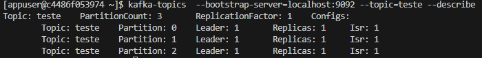

# Kafka - Comandos Básicos

Em todos os comandos precisamos informar o server do kafka

```--bootstrap-server=localhost:9092```

## kafka-topics

Criar um tópico

```kafka-topics --bootstrap-server=localhost:9092 --create --topic=teste --partitions=3```

Listar tópicos

```kafka-topics --list --bootstrap-server=localhost:9092```

Ver detalhes

```kafka-topics --bootstrap-server=localhost:9092 --topic=teste --describe```



## kafka-console-consumer

Consulta e exibe as mensagens do tópico

```kafka-console-consumer --bootstrap-server=localhost:9092 --topic=teste```

- ```--from-beginning```: ler do começo
- ```--group=x```: Adiciona a um consumer group

## kafka-console-producer

```kafka-console-producer --bootstrap-server=localhost:9092 --topic=teste```

Quando um tópico possui várias partições as mensagens são enviadas para partições diferentes, logo ele pode ir lendo de várias partições ao mesmo tempo e não lendo na ordem de chegada
