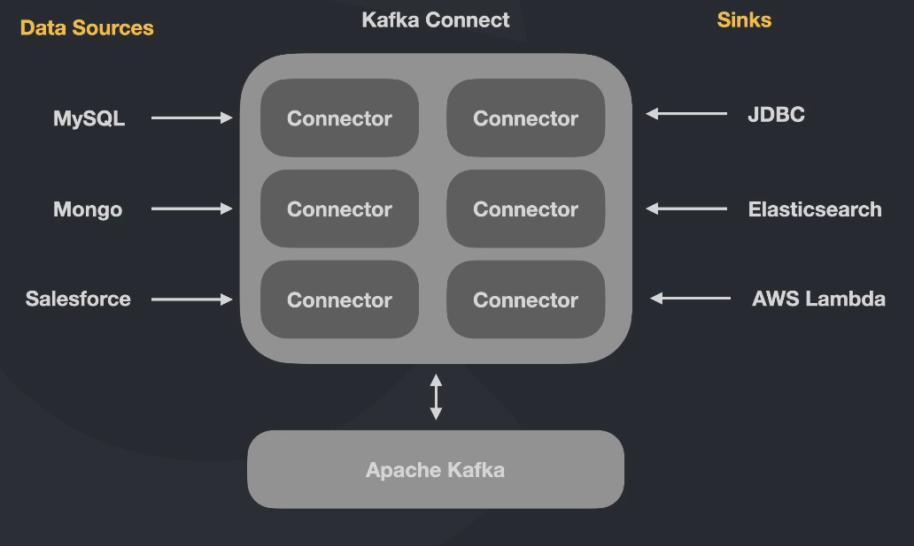
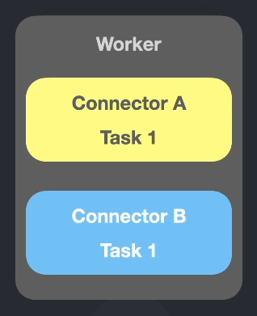
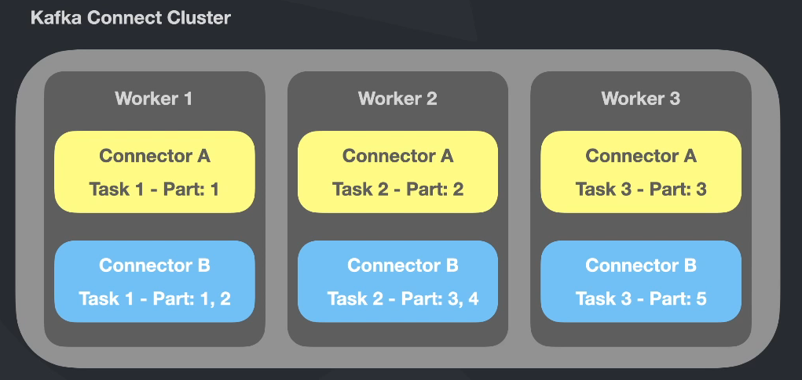
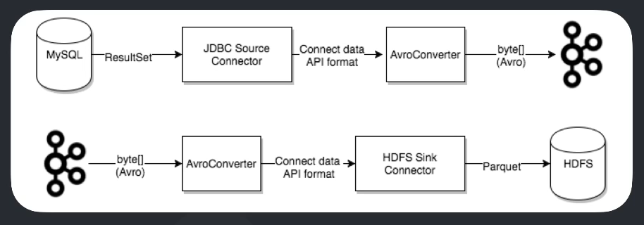

# Kafka Connect

## Intro

"Kafka Connect é um componente gratuito e open-source do Apache Kafka que trabalha como um hub dados centralizado para integrações simples entre banco de dados, key-value stores, search indexes e file systems."

[Doc oficial](https://docs.confluent.io/platform/current/connect/index.html)

Funciona como hub que recebe dados e jogam para outro lado

## Dinâmica

O Kafka Connect tem o que chamamos de Connectors, os quais são responsáveis por trazer os dados e também dar vazão



- Data Sources: Pegam dados e jogam para o Apache Kafka
- Sinks: Para onde serão enviados os dados enviados para o Apache Kafka

## Funcionamento

### Workers

O Kafka Connect é formado por Workers, que é máquina, um node. E podem ser de vários tipos

#### Standalone Workers

Responsável por executar as Tasks.



As Tasks são é os processos que rodam no worker, podendo rodar vários simultaneamente e não precisam ter relação nenhuma. Um worker pode executar várias tasks que não possuem nenhum tipo de co-relação

Lembrando que quanto mais tasks mais demorado é para realizá-las pois o poder computacional é divido entre elas

#### Distributed Workers

Podemos informar que os workers pertencem a grupo (groupId). Isso serve para que um determinada task seja distribuída entre todos os workers.

Ex.: Temos um tópico com muuuuitooos dados e 3 partições. Podemos criar um grupo com 3 workers e cada um com a mesma task, só que consultando de partições diferentes

Funciona bem parecido com um consumer group, os workers não acessam outras partições e o processamento fica bem mais veloz



O ideal é cada worker ter somente uma tarefa para ficar ainda mais distribuído e performático

### Converters

As tasks utilizam os "converters" para mudar o formato dos dados tanto para leitura ou escrita no Kafka.

Quando pegamos um dados para salvar no Apache Kafka ou então que consome dele e registra em outro local nem sempre esse dado vai estar no formato desejado.

Os Converters servem para mostrar qual o tipo e formato do dado que vamos trabalhar

Formatos conhecidos:

- Avro
- Protobuf
- JsonSchema
- Json
- String
- ByteArray



### DLQ - Dead Letter Queue

Quando há um registro inválido, independente da razão, o erro pode ser tratado nas configurações do conector através da propriedade "errors.tolerance".

Esse tipo de configuração pode ser realizado apenas para conectores do tipo "Sink".

Tipos de tolerância:

- none (default): Faz a tarefa falhar imediatamente, ocasiona a interrupção da task no worker
- all: Erros são ignorados e o processo continua normalmente. Não vou saber que o erro aconteceu, não terá logs de erro
- all + ```errors.deadletterqueue.topic.name = nome-do-topico```: sempre que der um erro, peque a mensagem e jogue para este tópico. O erro será gravado no cabeçalho da mensagem

## Confluent Hub

É onde consultamos os plugins que podem ser adicionados ao Kafka.
[Site Oficial](https://www.confluent.io/hub/)
