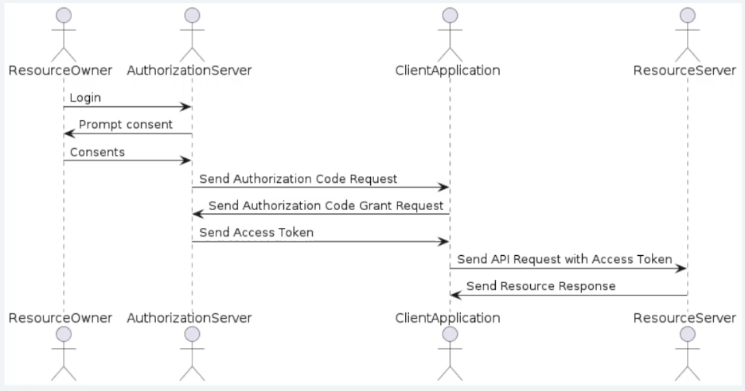
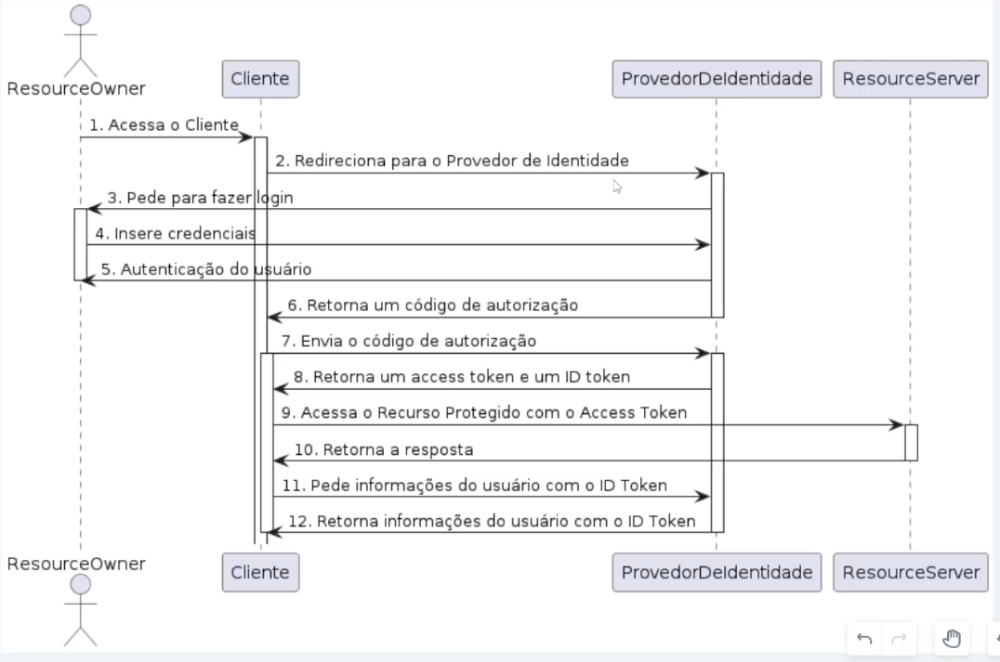

# Autenticação e Keycloak - Intro

## O que é OAuth 2.0

É um framework de autorização que permite que terceiros tenham acesso limitado a recursos protegidos em nome do proprietário do recurso, sem a necessidade de compartilhar as credenciais de acesso

Os principais atores são:

- Resource Owner: é o usuário que possui os dados protegidos que serão acessados
- OAuth Server: é o servidor que autentica o dono do recurso e concede permissões de acesso ao aplicativo solicitante
- Client: é o aplicativo que solicita acesso ao recurso protegido
- Resource Server: é o servidor que hospeda o recurso protegido que o Client deseja acessar

## Open ID Connect

OpenID 1.0 já permitia que os usuários se autenticassem em diferentes sites usando um única identidade, mas era limitado e vulnerável

O (OpenID 2.0) OpenID Connect é basicamente a junção do OAuth 2.0 + Autenticação

### Observação

Para melhor entendimento dos pontos acima, assistir as aulas

## Keycloak

### O que é

É um projeto criado para facilitar a autenticação entre serviços. É bem completo, robusto, seguro e personalizável

Foi construído em Java e as versões mais atuais utiliza o React em vez do Angular como framework frontend

Com ele conseguimos manter um fluxo de autenticação e autorização contínuo e funcional. Além de poder autorizar aplicativos externos já que ele usa o OAuth 2

### Principais Características

- Suporte a múltiplas plataformas: Utilizado nas mais diversas linguagens de programação
- Integração com diversos provedores de identidade, como Google, Facebook, etc.
- Administração centralizada: Todo o controle de tokens, usuários, grupos, clients, etc fica em um só local
- Proteção de API com tokens de acesso baseado no OAuth2.0 e OpenID Connect
- Personalização dos temas e telas frontend
- Suporte a multi-tenancy: O Keycloak tem o conceito de reinos que foi criado justamente para esses casos em que queremos manter uma separação por escopos
- Integração com DevOps: Docker, Kubernetes
- Extensibilidade: O Keycloak é altamente extensível e pode ser facilmente estendido com plugins e APIS personalizadas.
- Alta escalabilidade: Altamente escalável e suporte grande volumes de tráfego e usuários
- Open Source: Você pode contribuir ou modificar para uso próprio, mas sempre tendo atenção com as licenças

### Principais Funcionalidades

- Autenticação de usuários: O Keycloak permite que os usuários se autentiquem em diferentes aplicativos usando diferentes métodos de autenticação, como login e senha, autenticação multi-fator, SSO e outras opções. E sempre com o conceito de single-sign on

- Gerenciamento de usuários: O Keycloak fornece um console de administração onde os administradores podem gerenciar usuários, atribuir papéis e permissões, e visualizar logs de atividades.

- Autorização de usuários: O Keycloak permite que os administradores configurem políticas de autorização para restringir o acesso a recursos específicos com base em papéis e permissões.

- Integração com diferentes protocolos de autenticação e autorização: O Keycloak suporta diferentes protocolos, como OAuth 2.0, OpenlD Connect e SAML 2.0, para permitir a integração com diferentes sistemas.

- Configuração flexível: O Keycloak oferece uma ampla variedade de configurações que podem ser personalizadas para atender às necessidades específicas de cada aplicativo ou serviço.

- Gerenciamento de sessão: O Keycloak fornece recursos para gerenciar sessões de usuário, incluindo controle de expiração, renovação e encerramento de sessões.

- Autenticação e autorização baseadas em níveis: O Keycloak permite que os administradores configurem políticas de autenticação e autorização em diferentes níveis, como aplicativo, grupo de usuários, função ou permissão.

### Principais Casos de Uso

- Single Sign-On (SSO): O Keycloak permite que os usuários façam login uma vez e acessem diferentes aplicativos e serviços sem a necessidade de autenticar novamente.

- Proteção de API: O Keycloak pode ser utilizado para proteger APIs, permitindo que apenas usuários autenticados e autorizados acessem recursos protegidos. Além disso, ele pode ser integrado com uma API Gateway e ela realiza as validações e renovações dos tokens.

- Gerenciamento de usuários: O Keycloak oferece recursos para gerenciar usuários, permitindo que os administradores adicionem, removam e gerenciem usuários e seus papéis e permissões.

- Autenticação multi-fator: O Keycloak suporta diferentes métodos de autenticação multi-fator, como autenticação por SMS, autenticação por e-mail ou autenticação por meio de aplicativo móvel.

- Integração com diferentes sistemas: O Keycloak pode ser integrado com diferentes sistemas, como sistemas de gerenciamento de conteúdo, sistemas de gerenciamento de aprendizado, sistemas de gerenciamento de identidade e outros.

- Gerenciamento de sessão: O Keycloak oferece recursos para gerenciar sessões de usuários, permitindo que os administradores configurem políticas de expiração, renovação e encerramento de sessões.

- Autorização baseada em papéis: O Keycloak permite que os administradores configurem políticas de autorização baseadas em papéis, permitindo que apenas usuários autorizados acessem recursos específicos.
