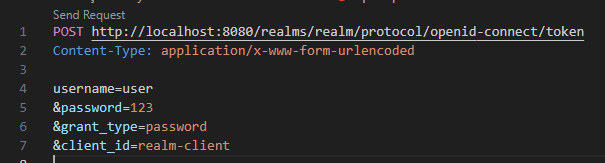

# ID e Access Token

Temos 2 tipos de tokens: ID e Access, sendo ambos no padrão JWT.

O JWT gerado pelo Keycloak utiliza um certificado com chaves públicas e privadas para maior segurança

## Gerando Access Token

Esse token representa a autorização, é utilizado para consumir informações internas

## ID Token

Ao adicionar o parâmetro `&scope=openid` na requisição do access token, nos teremos nosso ID token.

Nele temos bem menos informações pois é somente a formalização da autenticação
