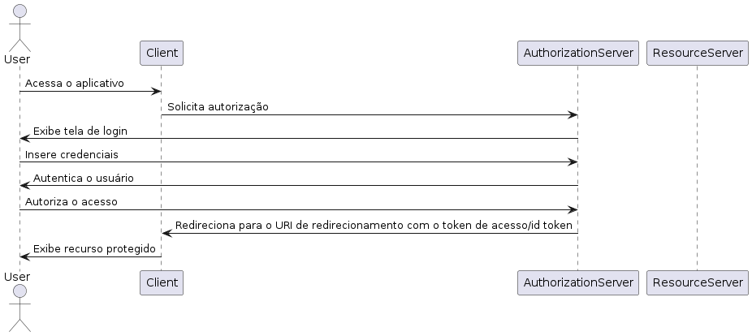
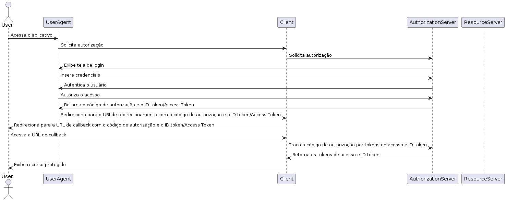

# Fluxos de Autenticação

## Introdução

Fluxos de autenticação é um processo com vários passos utilizados para autenticar algo/alguém.

O Keycloak possui vários fluxos de autenticação e precisamos compreender cada um para entender quando usar cada um.
Não compreender os fluxos pode gerar brechas de segurança que poderiam ser identificadas se tivéssemos total entendimento.

Um API rest em GoLang precisa de um fluxo diferente de uma SPA em ReactJS. Utilizar um fluxo inadequado não permite o uso do single sign on, uma das vantagens de utilizar um provedor de identidade.

## Fluxos de Autenticação - Authorization Code

### Características

- Comum e bem aceito pela web
- Bem versátil: pode ser utilizado em API, SPA, mobile, client
- Seguro pois a autenticação ocorre no Keycloak
- Single Sign On


### Segurança

Quando implementamos algum tipo de Autenticação/Autorização devemos ter noção da vulnerabilidades que esse método possui.

É necessário se aprofundar um pouco para ter noção dos perigos que sua aplicação pode estar correndo.

### Ataques de Rede - Replay Attack

Vimos que o fluxo de login é: user -> acessa o sistema -> manda para o keycloak -> informa os dados para o keycloak -> redireciona para um rota retornando junto o auth code.

#### Problemática

Esse último passo, temo o seguinte código:

```ts
app.get('/callback', async (req, res) => {
  const body = {
    client_id: 'realm-client',
    grant_type: 'authorization_code',
    code: req.query.code as string,
    redirect_uri: 'http://localhost:3000/callback',
  }

  const url = 'http://host.docker.internal:8080/realms/Realm/protocol/openid-connect/token';

  const result = await fetch(url, {
    method: 'POST',
    body: new URLSearchParams(body),
    headers: {
      'Content-Type': 'application/x-www-form-urlencoded',
    },
  }).then((response) => response.json());

  res.send(result);
})
```

Esse código esta sujeito a um reply attack. Esse tipo ataque ocorre quando o atacante possui acesso sua rede e consegue capturar a chamada de callback. Da forma que foi escrito o código, o atacante pode realizar a chamada de callback novamente e gerar novos tokens, provendo acesso indevido para ele.

#### Solução - Nonce

Nonce significa "number used once". Essa estratégia se baseia em gerar um valor, salvá-lo quando o login for chamado e informar para o provedor identidade. Assim, os tokens serão criados com esse valor e na rota callback será feita a validação desse nonce.

```ts
 const payloadAccessToken = jwt.decode(result.access_token) as any;
 const payloadRefreshToken = jwt.decode(result.refresh_token) as any;
 const payloadIdToken = jwt.decode(result.id_token) as any;

 // @ts-expect-error - type mismatch
 const nonce = req.session.nonce;

 if (payloadIdToken.nonce !== nonce || payloadAccessToken.nonce !== nonce || payloadRefreshToken.nonce !== nonce) {
  return res.status(401).json({ message: 'Unauthorized' });
 }
```

Ao realizar o login, criamos o nonce e salvamos na sessão. Dessa forma, na rota callback, validamos se o nonce do token é igual ao nonce da sessão.

Com isso, impedimos que um atacante consiga realizar um reply attack.

### Ataques de Rede - CSRF Attack (Cross-Site Request Forgery)

#### Situação

Imagine que estamos autenticados em um site que posso realizar transferências bancárias. Utilizando meu navegador acesso um outro site, mas esse site é malicioso e fica fazendo chamadas POST para esse site que estou autenticado. Como meu usuário está logado, essas chamadas serão um sucesso caso sejam passados dados válidos.

Acho que deu pra entender que isso é um problema: site malicioso fazendo requisições para sites que já estou autenticado.

#### State Parameter

Tem a ideia parecida com o nonce mas é utilizado para proteger contra CSRF. O state é um valor que também é gerado na hora do login e é passado para o provedor de identidade. Quando o provedor de identidade redireciona para a rota de callback, ele retorna esse valor. Assim, podemos validar se o valor retornado é igual ao valor que foi enviado.

Quando autenticado, esse state é salvo nos formulários, normalmente em um campo hidden. Assim, quando o formulário for submetido, o state será enviado e validado.

Com essa camada de segurança, impedimos que um site malicioso consiga realizar requisições para sites que já estamos autenticados.

## Fluxos de Autenticação - Implicit Flow

- parecido com o auth code
- para aplicações front-end
- retorna os tokens diretamente para o cliente
- não é recomendado, apenas para aplicações internas



O maior problema desse flow é a segurança. Como os tokens são retornados diretamente na URL, permitindo que qualquer pessoa que tenha/consiga acesso a rede consiga capturar esses tokens.

E hoje em dia temos plataformas de monitoramento que salvam as rotas acessadas, então, alguém sem autorização pode ter acesso a esses tokens.

## Fluxos de Autenticação - Hybrid Flow

- Semelhante ao Implicit Flow
- = Implicit Flow + Authorization Code. No auth code rebemos o code para depois trocar por tokens. No implicit, recebemos os tokens diretamente.
Nesse recebemos ambos, o code e os tokens. Assim temos um etapa a menos (performance) e ainda podemos renovar a sessão (segurança).


