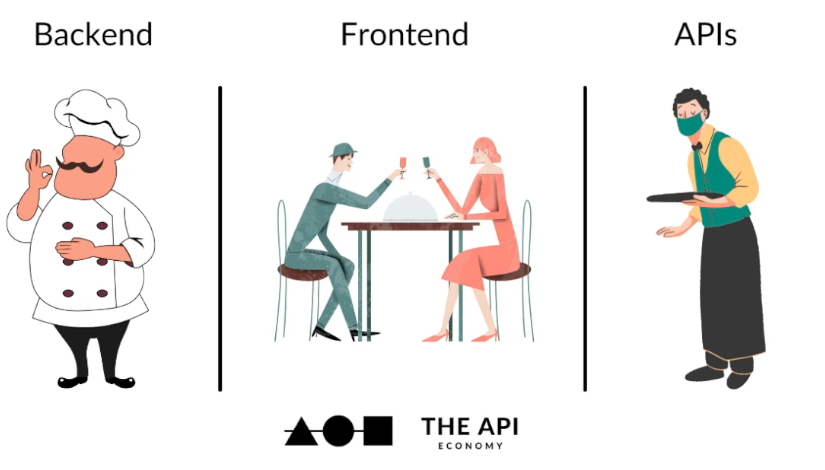
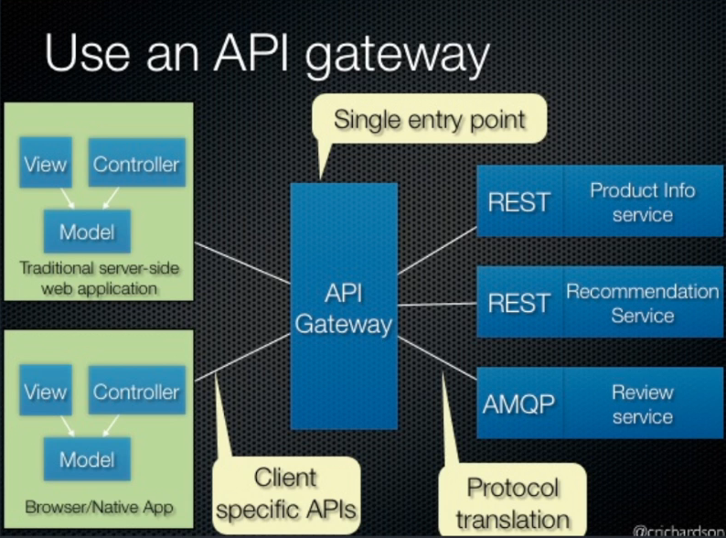
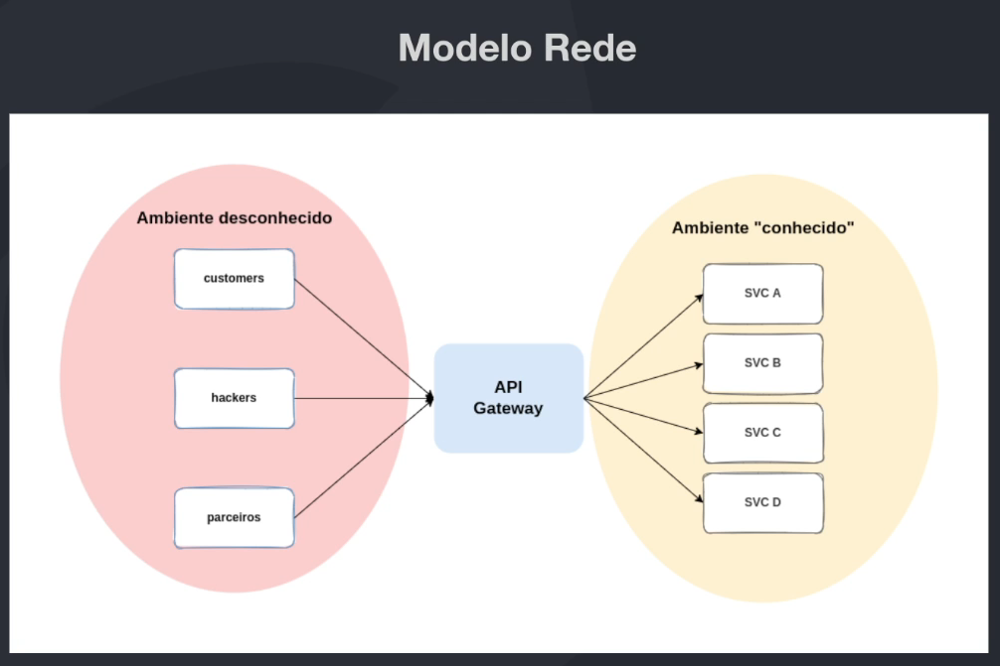
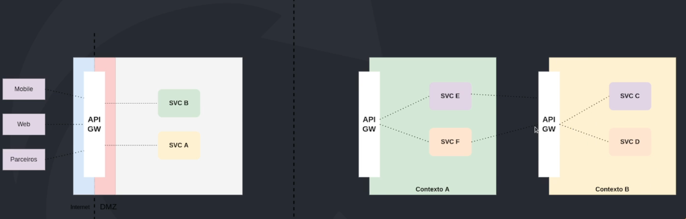
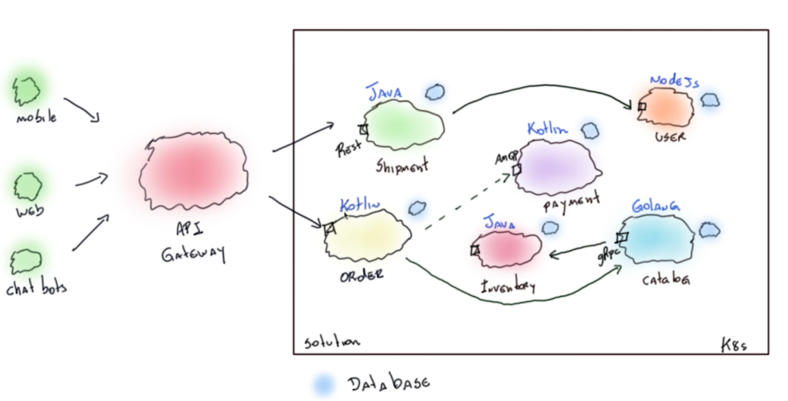
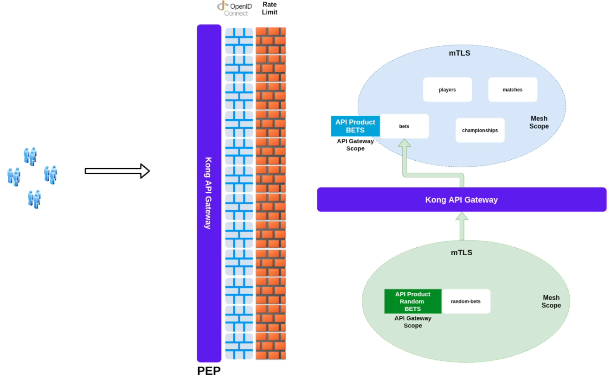

# Conceitos Básicos

## API

API é a sigla para Application Programming Interface. É um conjunto de operações que visam oferecer um serviço, produto ou integração.

O consumidor não tem necessidade de saber como a API foi construída, apenas como utilizá-la. É um característica que deve ser preservada, ABSTRAÇÃO.

Neste módulos vamos abordar API's REST, que são um estilo de arquitetura de software que utiliza os verbos HTTP para manipulação de recursos.

## API Gateway

### API Gateway Pattern

O padrão API Gateway é um padrão de design de software que é comumente usado em desenvolvimento de software. Sua ideia é fornecer uma única interface unificada para várias interfaces de API.

Imagine que você tenha várias API's que são consumidas por um cliente. O cliente teria que conhecer todas as URL's e identificadores desse serviço. Com o API Gateway, temos somente 1 URL e o Gateway se encarrega de rotear a requisição para o serviço correto. Ou seja, apenas uma URL é exposta para o cliente.

Quando vamos para o mundo do microsserviços isso fica mais problemático.

### Funcionamento

#### Single Entry Point

Um característica importante do API Gateway é que ela deve ser o único ponto de entrada para as requisições. Isso facilita a manutenção e a segurança da aplicação.

Dessa forma, podemos imaginar que o API Gateway é um ponto único de falha, visto que se ele parar tudo para junto. Então devemos ter muito cuidado, ele deve ser escalado e distribuído para garantir a disponibilidade do serviço.

#### O que é um API Gateway?

É uma ferramenta de gerenciamento, geralmente adicionada entre o cliente e um grupo de sistemas de um determinado contexto, atuando como ponto único de entrada das APIs.

Geralmente o API Gateway atual na camada de rede, provendo funcionalidades ortogonais, as que não necessariamente são responsabilidades das aplicações.

Por se encontrar entre o ambiente conhecido e desconhecido que o API Gateway é um ponto de entrada, controle e segurança. Ele pode ser usado para proteger contra ataques, monitorar o tráfego, gerenciar a autenticação e autorização, e muito mais.

**Funcionalidades comuns de um API Gateway:**

- Controle de abuso ( rate limiting )
- Autenticação / Autorização de maneira padronizada
- Controle de Logs
- Gerenciamento de API's ( routing )
- Métricas padronizadas ( ops team )
- Tracing Distribuído

### Tipos de API Gateway

#### Enterprise Gateway

Em geral é uma oferta de algum vendor, com estratégias comerciais suportando a solução. Este também tende a direcionar a aplicação da solução e implicar no design dos seus serviços.

São gateways que são utilizados em grandes empresas, geralmente são soluções pagas e robustas. Exemplos: Apigee, AWS API Gateway, Azure API Management.

Um ponto de atenção é que esses gateways possuem funcionalidades únicas dependendo do fornecedor, então se você escolher um e utilizar muitos dessas exclusividades, pode ser que fique preso a ele. Então migrar para outro fornecedor pode ser um desafio e também isso pode ditar como seus serviços devem ser construídos.

**Características**:

- **Propósito principal:** Exposição, composição e gerenciamento de APIS externas/internas
- **Manutenção das APIS:** Time de APIS em geral faz administração via Portal do API Gateway
- **Suporte a ambientes:** Suporta múltiplos ambientes DEV, QA e Prod.

Em geral Enterprise Gateways precisam de dependências externas, como banco de dados, caches entre outros, CUIDADO isso pode aumentar suas chances de ter indisponibilidade. Elas normalmente são utilizas na borda da rede.

#### Microservices Gateway

Tipicamente essa classe de Gateways tem a capacidade de "rotear" tráfego de entrada para APIS ou serviços. Em geral não oferecem suporte ao ciclo de vida das APIS e as equipes tem que fazê-lo via processo separado.

**Características**:

- **Propósito principal:** Exposição, observabilidade e monitoramento de serviços ( APIS )
- **Manutenção das APIS:** Time de API ou time de criação/manutenção do serviço via configuração declarativa fazem atualizações, esta tarefa faz parte do deployment dos serviços
- **Suporte a ambientes:** A instância controla um único ambiente, possui suporte a roteamento
mais dinâmico como por exemplo Canary para facilitar o debugging.

Esse tipo de Gateway prover uma maior escalabilidade e granularidade de controle, porém é mais complexo de ser configurado e mantido. Devemos ter cuidado para não ter um excesso de Gateways.

Um exemplo de uso é esse da imagem acima, onde temos um API Gateway como porta de entrada, mas dentro do nosso ambiente de microsserviços temos Gateways para grupos de serviço (contexto).

## Papel da API Gateway na Arquitetura de Microsserviços

### O que são microsserviços?

Microsserviços são uma abordagem de arquitetura de software que consiste em dividir uma aplicação em um conjunto de serviços pequenos e independentes, que são executados em seu próprio processo e se comunicam por meio de mecanismos leves.

Porém, esse tipo de arquitetura pode trazer alguns problemas de complexidade ao decorrer do tempo. Como o hyperconnectivity mess.

Esse problema é causado pelo excesso de chamadas de rede entre os serviço. Exemplo, o serviço A chama o B que precisa do J e do K, que por sua vez chamam o C e o D. Junto disso temos o fato de que cada serviço precisa conhecer o endereço de todos os outros serviços para se comunicar.

### API Gateway e Microsserviços

Podemos utilizar o API Gateway da seguinte forma:

Um utilizado na borda, com políticas de segurança, rate limiting, autenticação e autorização. E os outros internos, com agrupamento de serviços, roteamento, governança e controle de tráfego.

Com isso, serviços de outros contextos não precisam conhecer o endereço de todos os outros serviços, apenas o Gateway, diminuindo o problema do hyperconnectivity mess e mitigando um pouco da death star.

## Vale a pena utilizar um API Gateway?

**Vantagens**:

- Padronização de algumas features ortogonais (logging, segurança).
- Ajuda na governança de rede da companhia.
- Ponto único de entrada na rede, facilita gerenciamento.
- Ferramenta essencial para adoção de uma estratégia de APIS.

**Desvantagens**:

- Adiciona alguma complexidade na sua arquitetura.
- Precisa de um cuidado extra, devido a disponibilidade.
- Ferramenta que precisa de manutenção/atualização.
