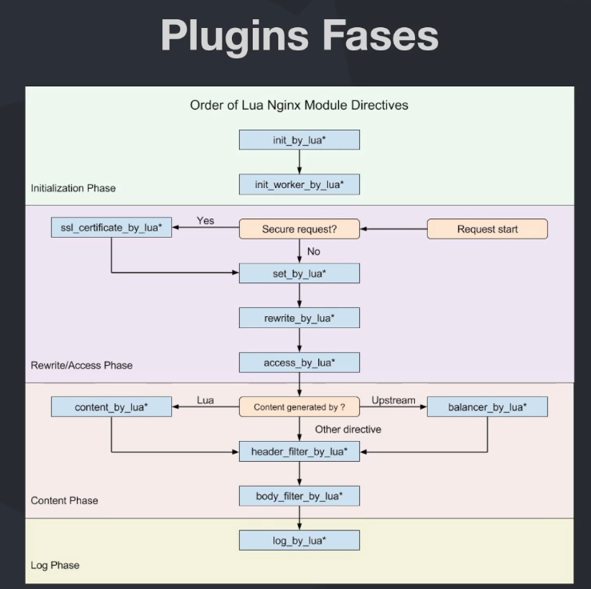

# Kong API Gateway

## Características

- **Open Source:** Kong é open source e pode ser usado em qualquer ambiente, seja ele on-premises ou na nuvem.
- **Micro Gateway:** Kong é um micro gateway, ou seja, ele é leve e pode ser usado em ambientes distribuídos.
- **Borda ou Interno:** Kong pode ser usado tanto na borda da rede, como internamente.
- **Pronto para Kubernetes:** Kong é pronto para ser usado em ambientes Kubernetes.
- **Extensível:** Kong é extensível via plugins, o que permite que você adicione funcionalidades customizadas.

## Arquitetura

### Componentes

- **API REST:** Kong possui uma API REST, o que significa que você pode interagir com ele via HTTP.
- **Plugins:** Kong possui uma arquitetura de plugins, o que permite que você adicione funcionalidades (polices) customizadas.
- **Clustering & Datastore:** São esse dois componentes que permitem que Kong seja escalável e distribuído.
- **Open Resty:** Kong é construído em cima do Open Resty, que é uma plataforma de aplicação web que é baseada em Nginx. Isso facilita algumas configurações e extensões.
- **Nginx:** Kong é construído em cima do Nginx, que é um servidor web open source.

### Fluxo da Requisição

1. **Downstream:** O cliente faz uma requisição para o Kong.
2. **Proxy:** Kong faz um proxy para o serviço correto.
3. **Upstream:** Kong faz uma requisição para o serviço.

## Subscriptions

Kong possui alguns tipos de subscriptions. Confira neste [link](https://konghq.com/pricing)

## Modelos de Deployment

### DB-Less: Sem banco de dados

Cada instância de Kong possui seu próprio arquivo de configuração e sãi independentes, não compartilham informações entre si.

Por não ter dependência externa isso o torna mas resiliente e o gerenciamento é mais simples.

### With DB: Com banco de dados

Kong pode ser configurado para usar um banco de dados, como o PostgreSQL, para armazenar informações de configuração.

Isso permite que você tenha um controle centralizado e compartilhado entre as instâncias.

### Deployment Distribuído

Suponto que temos 3 nós do Kong, o primeiro seria o nó principal, onde as configurações são feitas. Os outros dois nós são nós secundários, que são sincronizados com o nó principal.

obs: kong manager e dev portal são pago

### Deployment Híbrido (Recomendado)

Nesse modo, somente a instância principal tem acesso ao banco de dados, os outros nós não tem acesso ao banco de dados, o que aumenta a resiliência.

As outras instâncias acessam a principal para pegar as configurações.

## Konga

A Konga é uma interface administrativa para o Kong API Gateway. Ela permite que você gerencie suas APIs, plugins e consumidores de uma maneira mais fácil.

Além disso, a Konga também fornece visualizações de métricas das instâncias do Kong, o que pode ser útil para monitoramento.

Outra funcionalidade interessante da Konga é o controle de usuários, que permite que você defina diferentes níveis de acesso para diferentes usuários.

## Principais Conceitos

### Services

Um Serviço é uma entidade que representa uma API ou microsserviço upstream — por exemplo, um microsserviço de transformação de dados ou uma API de cobrança.

Apenas criar o serviço não significa que ele está disponível para ser acessado. Para isso, é necessário criar uma rota.

### Rotas

"Caminho" de url que permite que um serviço seja acessado pelo Kong API Gateway. Ela é responsável por mapear uma requisição HTTP para um serviço.

### Plugins (Police)

Um pedaço de código que pode ser executado dentro de um ciclo de vida de uma requisição HTTP, tanto na fase de request como no response.

Podem ser configurados nas Rotas, Serviços, Consumers e Globalmente, atente-se a precedência das configurações.

### Consumers

Representa um consumidor que pode ser usuário ou um serviço, esse pode ser utilizado para aplicação de plugins de segurança.

## Observabilidade

### Monitoramento - Métricas

Para coletar métricas do Kong, você pode usar o plugin Prometheus. Este plugin coleta métricas do Kong e as expõe em um endpoint HTTP.

Para visualizar essas métricas, você pode usar o Grafana. O Grafana é uma ferramenta de visualização de métricas e permite que você crie dashboards personalizados.

Seguimos o seguinte passo a passo:

1. Subir o Grafana e o Prometheus com a configuração apontando para o Kong.
2. Criar uma conexão com o Prometheus no Grafana.
3. Adicionar o plugin Prometheus no Kong.
4. Adicionar um dashboard no Grafana. Utilizei o [dashboard oficial](https://grafana.com/grafana/dashboards/7424-kong-official/) do Kong.
5. Realizar requisições no Kong para gerar métricas.

E pronto! Agora você pode visualizar as métricas do Kong no Grafana.

### Logging

Para Logging, precisamos das seguintes ferramentas

- **Elasticsearch:** Banco de dados que armazena os logs.
- **Kibana:** Interface gráfica para visualizar os logs.
- **Fluent Bit:** Coletor de logs que envia os logs para o Elasticsearch.

Seguimos o seguinte passo a passo:

1. Subir o Elasticsearch, Kibana e Fluent Bit.
2. Adicionar o plugin TCP Log no Kong, sendo o host o fluent-bit.
3. Acessar o Kibana e criar um index pattern.
4. Realizar requisições no Kong para gerar logs.
5. Acessar o Kibana na área Discover e ver os logs.

### Trace Distribuído

Para Trace Distribuído, precisamos subir o Jaeger, que é uma ferramenta open source para monitoramento de aplicações distribuídas.

Seguimos o seguinte passo a passo:

1. Subir o Jaeger.
2. Adicionar o plugin Zipkin no Kong, sendo o host a rota <http://jaeger:9411/api/v2/spans>.
3. Realizar requisições no Kong para gerar traces.
4. Acessar o Jaeger e ver os traces.
