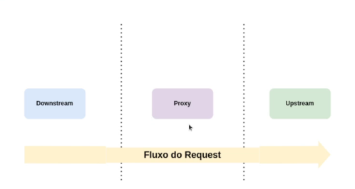
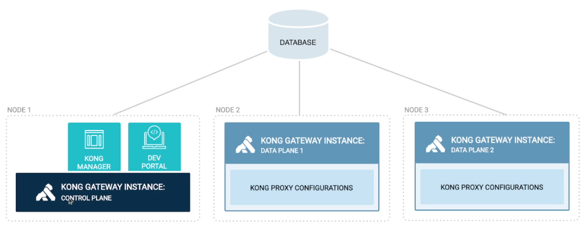
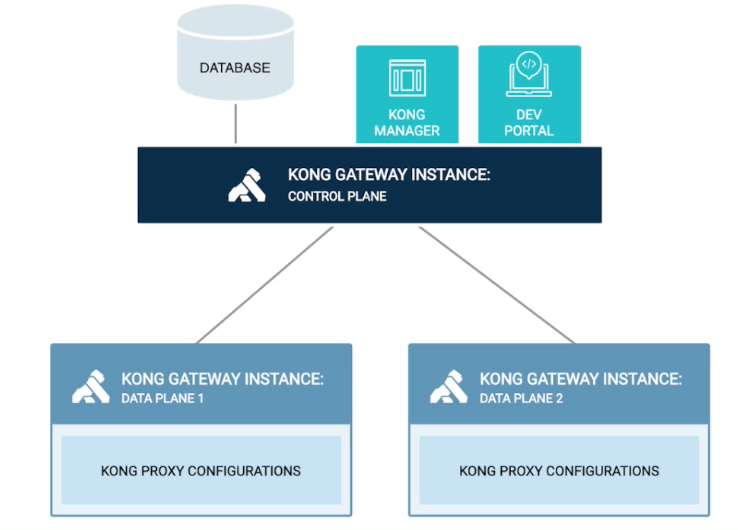

# Kong API Gateway

## Características

- **Open Source:** Kong é open source e pode ser usado em qualquer ambiente, seja ele on-premises ou na nuvem.
- **Micro Gateway:** Kong é um micro gateway, ou seja, ele é leve e pode ser usado em ambientes distribuídos.
- **Borda ou Interno:** Kong pode ser usado tanto na borda da rede, como internamente.
- **Pronto para Kubernetes:** Kong é pronto para ser usado em ambientes Kubernetes.
- **Extensível:** Kong é extensível via plugins, o que permite que você adicione funcionalidades customizadas.

## Arquitetura

### Componentes

- **API REST:** Kong possui uma API REST, o que significa que você pode interagir com ele via HTTP.
- **Plugins:** Kong possui uma arquitetura de plugins, o que permite que você adicione funcionalidades (polices) customizadas.
- **Clustering & Datastore:** São esse dois componentes que permitem que Kong seja escalável e distribuído.
- **Open Resty:** Kong é construído em cima do Open Resty, que é uma plataforma de aplicação web que é baseada em Nginx. Isso facilita algumas configurações e extensões.
- **Nginx:** Kong é construído em cima do Nginx, que é um servidor web open source.

### Fluxo da Requisição

1. **Downstream:** O cliente faz uma requisição para o Kong.
2. **Proxy:** Kong faz um proxy para o serviço correto.
3. **Upstream:** Kong faz uma requisição para o serviço.

## Subscriptions

Kong possui alguns tipos de subscriptions. Confira neste [link](https://konghq.com/pricing)

## Modelos de Deployment

### DB-Less: Sem banco de dados

Cada instância de Kong possui seu próprio arquivo de configuração e sãi independentes, não compartilham informações entre si.

Por não ter dependência externa isso o torna mas resiliente e o gerenciamento é mais simples.

### With DB: Com banco de dados

Kong pode ser configurado para usar um banco de dados, como o PostgreSQL, para armazenar informações de configuração.

Isso permite que você tenha um controle centralizado e compartilhado entre as instâncias.

### Deployment Distribuído

Suponto que temos 3 nós do Kong, o primeiro seria o nó principal, onde as configurações são feitas. Os outros dois nós são nós secundários, que são sincronizados com o nó principal.

obs: kong manager e dev portal são pago

### Deployment Híbrido (Recomendado)

Nesse modo, somente a instância principal tem acesso ao banco de dados, os outros nós não tem acesso ao banco de dados, o que aumenta a resiliência.

As outras instâncias acessam a principal para pegar as configurações.

## Konga

A Konga é uma interface administrativa para o Kong API Gateway. Ela permite que você gerencie suas APIs, plugins e consumidores de uma maneira mais fácil.

Além disso, a Konga também fornece visualizações de métricas das instâncias do Kong, o que pode ser útil para monitoramento.

Outra funcionalidade interessante da Konga é o controle de usuários, que permite que você defina diferentes níveis de acesso para diferentes usuários.

## Principais Conceitos

### Services

Um Serviço é uma entidade que representa uma API ou microsserviço upstream — por exemplo, um microsserviço de transformação de dados ou uma API de cobrança.

Apenas criar o serviço não significa que ele está disponível para ser acessado. Para isso, é necessário criar uma rota.

### Rotas

"Caminho" de url que permite que um serviço seja acessado pelo Kong API Gateway. Ela é responsável por mapear uma requisição HTTP para um serviço.
