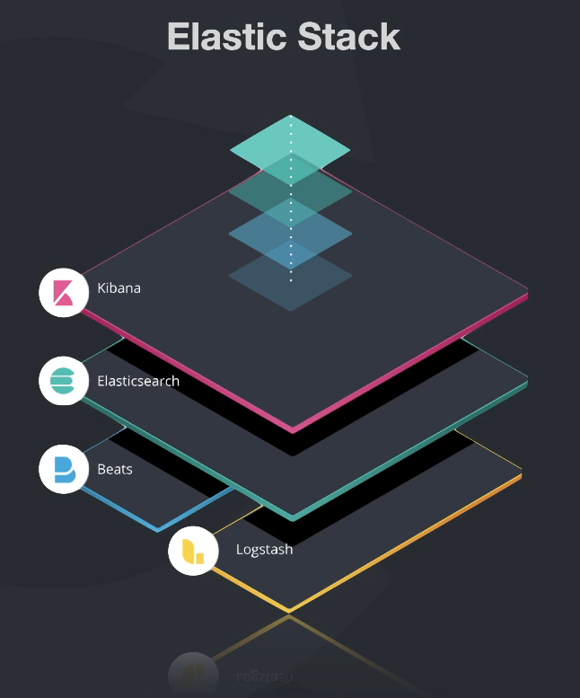

# Elastic Stack

## Surgimento

Antigamente tínhamos a ELK Stack que era conhecido como um conjunto de ferramentas open source, que eram:

- **Elasticsearch**: Motor de busca e análise de dados distribuído e RESTful.
- **Logstash**: Pipeline de processamento de dados que ingere dados de várias fontes simultaneamente, transforma e envia para o Elasticsearch.
- **Kibana**: Interface gráfica para visualização de dados do Elasticsearch em diversas perspectivas.

### Elasticsearch

É um search engine analytics, isso significa que quando ele contém dados, ele é capaz de fazer buscas e análises em cima desses dados de uma forma bem rápida. Ele trabalha com índices e os dados são em formato de documentos JSON.

Ele surgiu em 2010 e foi criado a partir do Apache Lucene, que é uma biblioteca de busca de texto em Java.

Possui uma API RESTful, ou seja, você pode fazer requisições HTTP para ele e ele te retorna os dados em JSON.

Consegue trabalhar com mapas e analisar dados geográficos.

Possui uma área para acompanhamento e análise de logs.

Ele é distribuído, ou seja, ele pode ser dividido em várias máquinas e trabalhar em conjunto, o que é muito bom para escalabilidade. Isso funciona através de um sistema de shards e replicação dos dados. Isso permite uma escalabilidade horizontal quase infinita, permitindo a análise de grandes volumes de dados.

### Logstash

É uma engine coletora de dados e transformadora de dados. Ele é capaz de coletar dados de várias fontes simultaneamente, transformar esses dados e enviar para o Elasticsearch.

Ele possui uma série de plugins que permitem a coleta de dados de várias fontes, como arquivos, bancos de dados, logs, etc.

### Kibana

Ferramenta de visualização e exploração de dados integrada com Elasticsearch. Com ela é possível criar dashboards, gráficos, tabelas, mapas, etc. É usada com: logs, análises de séries temporais, monitoramento de infraestrutura, etc.

Com ele podemos agregar, filtrar, analisar e visualizar dados.

## Diferença entre ELK Stack e Elastic Stack

### Beats

Os criadores da ELK perceberam que o Logstash estava ficando muito pesado e ficando muito trabalhoso para fazer a manutenção. Então eles resolveram dividir o Logstash em vários pedaços, criando assim o Beats.

Beats é uma ferramenta que foi adicionada ao Elastic Stack, que é um conjunto de ferramentas que coleta dados de várias fontes e envia para o Elasticsearch ou Logstash.

"Lightweight data shippers" que enviam dados para o Elasticsearch ou Logstash.

Existem vários tipos de Beats, para logs, métricas, etc. E você pode criar o seu próprio Beat.

### Conclusão

A Elastic Stack é a evolução da ELK Stack, que agora possui os Beats.

## O que é "Elastic"?

É a empresa por trás dessas soluções. Tudo que é open source é mantido pela Elastic, mas eles também possuem soluções pagas, como o Elastic Cloud, que é o Elasticsearch como serviço.

## Subindo o Elastic Stack com Docker + WSL2

Referência: [Aula Full Cycle](https://plataforma.fullcycle.com.br/courses/3b8c4f2c-aff9-4399-a72a-ad879e5689a2/274/168/119/conteudos?capitulo=119&conteudo=7201) e [GitHub](https://github.com/codeedu/fc2-observabilidade-elastic)

## Anotações

### Kibana

Para acessar o Kibana, acesse `http://localhost:5601`.

- **Index Patterns**: É uma forma de você dizer para o Kibana quais são os índices que você quer visualizar. Você pode usar o padrão `*` para visualizar todos os índices.

- **Analytics -> Discover**: Aqui você pode ver os dados que estão sendo enviados para o Elasticsearch.
