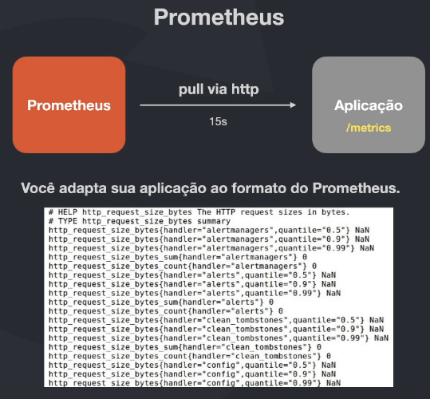
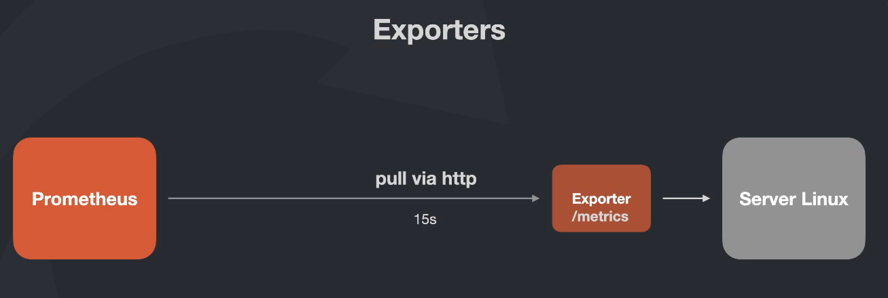
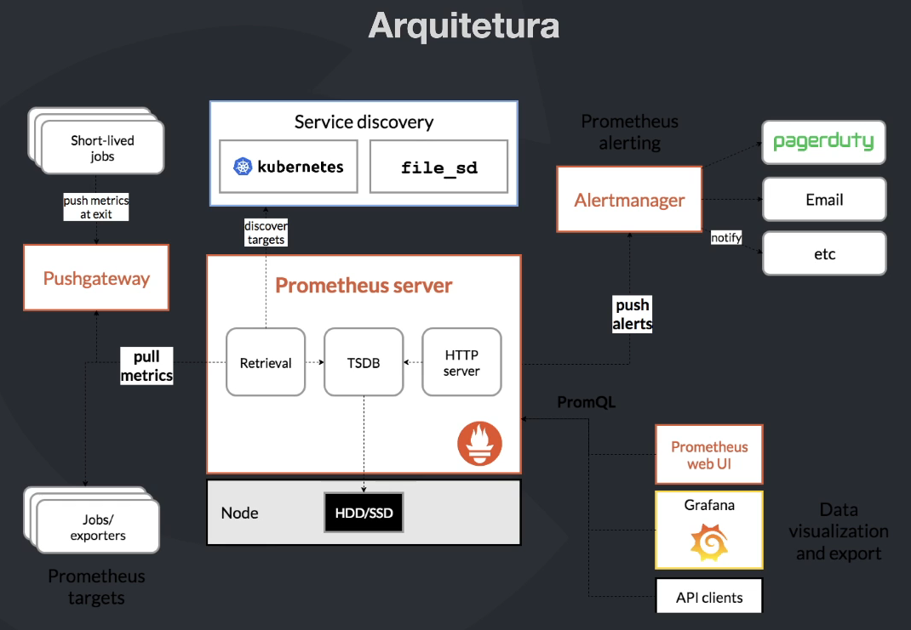

# Prometheus

## Conceitos iniciais

"From metrics to insight"
"Power your metrics and alerting with a leading open-source monitoring solution."

Prometheus é um sistema de monitoramento e alerta de código aberto. Ele coleta métricas de seus alvos em intervalos regulares, avalia expressões de regras, exibe os resultados e pode acionar alertas se alguma condição for observada como verdadeira.

Foi criado pela SoundCloud em 2012 e atualmente é um projeto de código aberto mantido pela Cloud Native Computing Foundation.

Características:

- **Multi-dimensional data model:** além de capturar dados crus (acessos, latência, etc), também é possível pegar dados no formato de histogramas, conseguimos assim coletar dados de forma mais rica e detalhada.
- **PromQL:** linguagem de consulta extremamente poderosa e flexível para consultar dados.
- **Grafana:** fácil integração com o Grafana para visualização de dados.
- **Storage:** Prometheus armazena todos os dados localmente e de forma eficiente.
- **Simples:** fácil de configurar e usar.
- **Alerta inteligente:** suporte a alertas.
- **Diversos exporters:** diversos exporters disponíveis para coletar dados de diferentes sistemas.

### Prometheus x Elastic Stack

Elastic Stack utiliza agentes para coletar dados e enviar de forma ativa para o ElasticSearch. (PUSH)

Prometheus precisa que a aplicação possua um endpoint http para consultar as métricas. (PULL)

## Coletando métricas

Vimos na imagem anterior que o Prometheus precisa dos dados em um formato específico para coletar as métricas.
Para isso, cada linguagem/framework possui uma biblioteca específica para expor essas métricas.

Um exemplo de métrica seria a quantidade de usuários utilizando um nova feature em um sistema. A aplicação poderia armazenar essa informação, conversar utilizando uma lib e expor essa métrica via http para o Prometheus e ele coletaria esses dados.

### Exporters

Mas quando são aplicações que não desenvolvemos, como MySQL, Servidor Linux, etc? Para isso existem os exporters. Exporters são aplicações que coletam as métricas desses sistemas e expõem em um formato que o Prometheus entende.

Existem exporters para diversos sistemas, como MySQL, Linux, Nginx, etc. Isso elevou o nível de monitoramento de sistemas, pois agora conseguimos monitorar praticamente tudo e não somente aplicações desenvolvidas com HTTP.

E também podemos criar nossos próprios exporters para coletar métricas específicas de nossas aplicações.

## Arquitetura

### Prometheus Server - coleta de métricas e armazenamento local

- **TSDB:** Time Series Database, banco de dados de séries temporais. Por ser baseado em datas, é muito eficiente para armazenar dados de métricas.
- **Retrieval:** recebe as informações e lança para o banco de dados. Orquestra todo o processo de coleta de métricas.
- **HTTP Server:** expõe uma API HTTP para consulta de métricas.

### Discover Targets

Para o Prometheus coletar as métricas, precisamos informar quais serviços serão monitorados. E quando os serviços são dinâmicos? ou possuem um número volátil de réplicas? Então precisamos que o Prometheus também seja dinâmico e saiba onde estão esses serviços.

Com objetivo de facilitar essa tarefa, o Prometheus se integra com serviços de Service Discovery, como o Consul, Kubernetes, etc.

### Push Gateway

Para casos onde não é possível expor um endpoint http para o Prometheus ou não faz sentido coletar essa métricas com muita frequência, podemos utilizar o Push Gateway.
Ele é um serviço que recebe as métricas e armazena temporariamente para o Prometheus coletar.

Essa é uma solução para casos específicos, como:

- Jobs temporários
- Jobs que não possuem um endpoint http para coletar as métricas
- Jobs com fluxo de utilização somente em períodos específicos

### Alert Manager

O Alert Manager é um componente que gerencia alertas. Ele se conecta ao Prometheus Server e recebe os alertas.

Ele possui diversas funcionalidades, como:

- Silenciamento de alertas
- Agregação de alertas
- Enviar alertas para diferentes serviços (Slack, PagerDuty, etc)

### Grafana

O Grafana é uma ferramenta de visualização de dados. Ele se conecta ao Prometheus e exibe os dados de forma gráfica. O Prometheus possui uma interface web para visualização de dados, mas é muito simples e o Grafana é muito mais poderoso e flexível.

## Dados

### Armazenamento

- TSDB (Time series Database)
- Armazenamento de dados que mudam conforme o tempo
- Labels para propriedades específicas de uma determinada métrica (error_type=500)
- Otimização específica para esse caso de uso, garantindo mais performance do que bancos de dados convencionais.
- Quanto mais novos os dados, mais precisão

### Tipos Métricas

Sempre que coletamos uma métrica, precisamos informar o tipo dela. Isso é importante para o Prometheus saber como tratar essa métrica.

#### Counter

- Sempre cresce: valor que sempre aumenta.
  - quantidade de requisições
  - quantidade de erros
  - quantidade de visitas
- Prometheus consegue absorver falhas no caso esse número tenha um eventual reset.

#### Gauge

- Valor pode possuir variações com o tempo.
  - quantidade de usuários online
  - quantidade de memória utilizada
  - quantidade de conexões
- Possível aumentar, diminuir ou estabilizar.

#### Histogram

- Distribuição de frequência de valores.
  - tempo de resposta de uma requisição
  - tamanho de arquivos
  - latência
- Medição é baseado em amostas, onde é possível calcular média, mediana, percentis, etc.
- Consegue agregar dados de forma mais rica e detalhada.

#### Summary

- Similar ao histogram, mas com mais funcionalidades.
- Com summary os valores são calculados no cliente e não no servidor. Os valores já são calculados e enviados para o Prometheus.

### PromQL

Prometheus Query Language, é uma linguagem de consulta extremamente poderosa e flexível para consultar dados.

É bem intuitiva e fácil de aprender, alguns exemplos:

- `http_requests_total{job="api-server", status="500"}`: retorna a quantidade de requisições com status 500.
- `rate(http_requests_total{job="api-server"}[5m])`: retorna a taxa de requisições nos últimos 5 minutos.
- `sum(rate(http_requests_total{job="api-server"}[5m])) by (status)`: retorna a taxa de requisições nos últimos 5 minutos agrupado por status.
